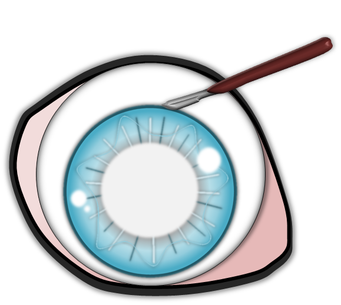
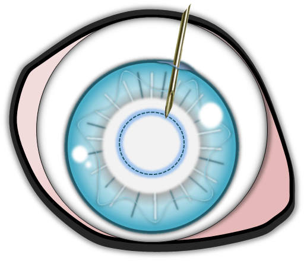
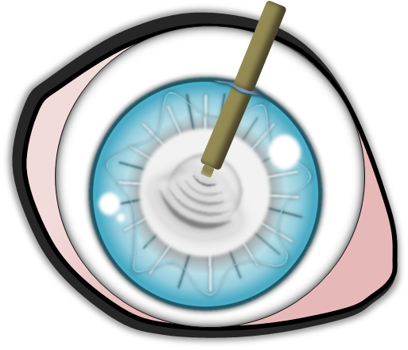
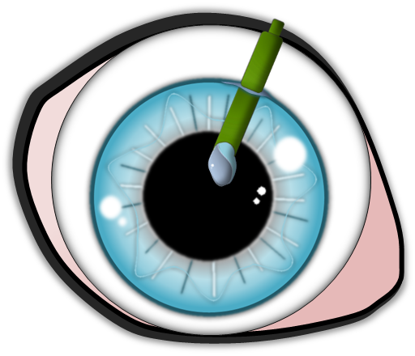
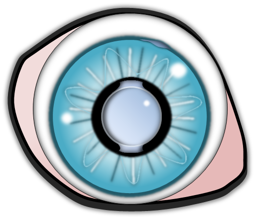
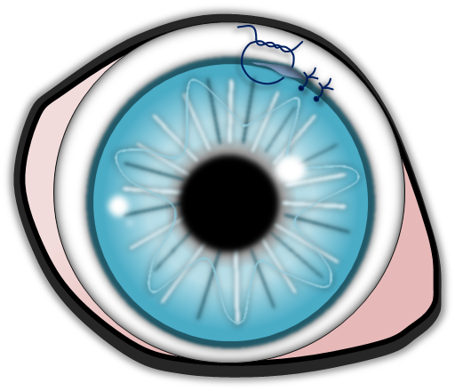

Der graue Star tritt beim Hund in jedem Alter auf, als erbliche und nicht erbliche Erkrankung. Der Krankheitsverlauf ist sehr unterschiedlich. Erbliche Katarakte zeigen häufig für die jeweilige Rasse spezifische Charakteristika.

<!--excerpt-->

## Der graue Star in jedem Alter

Je nachdem, wann er entsteht, unterscheidet man den angeborenen (kongenitalen) grauen Star, vom juvenilen (Jugendstar) und senilen Star (Altersstar).

Ein _angeborener grauer Star_ kann als solcher zweifelsfrei nur bei Untersuchungen vor der achten Lebenswoche diagnostiziert werden. Angeborene Linsentrübungen gehen nicht selten mit Linsenmissbildungen oder anderen Fehlbildungen des Auges einher. Die frühe Beeinträchtigung des Sehvermögens behindert die Entwicklung des Sehzentrums im Gehirn. Eine frühzeitige Therapie ist bei angeborenen Katarakten wichtig.

Der _juvenile graue Star_ ist sehr häufig und in der Regel erblich. Er kann lange stationär bleiben aber auch rasant fortschreiten und in kurzer Zeit zur vollständigen Erblindung führen. 

Die in höherem Alter auftretenden senilen Katarakte sind sehr häufig und werden nicht als erblich angesehen. Sie haben meist ein typisches Aussehen und schreiten nur langsam fort. Von einem Altersstar spricht man ab dem siebten Lebensjahr bei sehr große Rassen und dem elften Lebensjahr bei kleinen Hunden. Eine Ausnahme bildet der Boston Terrier. Bei dieser Rasse ist eine erbliche Spätform des grauen Stares beschrieben.
 
Achtung Verwechslungsgefahr! Die Linse unterliegt einer normalen altersbedingten Veränderung, der sogenannten Nukleussklerose. Dabei wird der Linsenkern mit zunehmendem Alter dichter und verleiht der Linse ein gräuliches Aussehen. Diese normale Alterserscheinung ist nicht seheinschränkend und nicht therapiebedürftig. Sie wird häufig mit einem grauen Star verwechselt. 

## Stadien des grauen Stares

Der graue Star entwickelt sich über mehrere Stadien. Das Stadium ist bedeutsam für die Sehbeeinträchtigung und den Zeitpunkt des Therapiebeginns. 

Am Anfang steht die incipiente (beginnende) Katarakt. In diesem Stadium sind unter 15% der Linse getrübt. Hier treten keine merklichen Sehstörungen auf. Sie kann sich weiterentwickeln zur immaturen (unreifen) Katarakt.  Hier fallen häufig schon deutliche Seheinschränkungen auf. Beim reifen (maturen) grauen Star ist die gesamte Linse vollständig eingetrübt, der Patient ist blind. Der reife graue Star geht mit der Zeit in einen hypermaturen (überreifen) Star über. Dabei verhärtet sich die Linse besonders und zieht sich etwas zusammen. Es ist möglich, dass sich aus diesem Stadium ein resorptiver grauer Star entwickelt. Dabei flacht die Linse deutlich ab und klart zum Teil sogar auf. Dieser Prozess birgt ein erhöhtes Risiko für eine Netzhautablösung.

## Ursachen

Graue Stare werden in erbliche Stare und Folgekatarakte unterteilt. Folgestare enstehen im Zusammenhang mit Augen- oder körperlichen Erkrankungen.

### _Erblicher grauer Star_

Er betrifft eine Vielzahl von Hunderassen. Zeitpunkt der Entstehung, Lokalisation, Form und vor allem das Fortschreiten sind sehr verschieden aber innerhalb einer Rasse oft charakteristisch. Viele Rassen wie der Boston Terrier, Golden und Labrador Retriever, Rottweiler, Deutscher Pinscher u.a. weisen mehr oder weniger typische graue Stare auf.  Häufig sind Vererbungsmodus und Genlokus noch nicht genau bekannt. Für einige Hunderassen (Australian Shepherd, Boston Terrier, Französische Bulldogge, Staffordshire Terrier,  Tibet Terrier) sind Gentests verfügbar.

### _Folgestar_

___Diabetogene Katarakt___

Hunde mit Diabetes mellitus haben ein hohes Risiko einen grauen Star zu entwickeln. Diese Starform schreitet sehr schnell fort, ist beidseitig und führt nicht selten innerhalb von ein bis zwei Wochen zur Erblindung. Im Zuge dieses schnellen Voranschreitens quillt die Linse stark auf (intumeszente Katarakt). Dabei kann es passieren, dass die dünne hintere Linsenkapsel dieser schnell wachsenden Belastung nicht standhalten kann und einreißt. Dies führt zu einer starken inneren Augenentzündung (phakoklastische Uveitis). Aus diesem Grund, ist bei der diabetischen Katarakt eine schnelle chirurgische Versorgung sehr wichtig.

___Traumatische Katarakte___

Infolge einer Augenverletzung kann sich ein grauer Star entwickeln. Ein klassisches Beispiel sind perforierende Hornhautverletzungen durch Katzenkrallen mit Verletzung der Linse bei jungen, (katzen-)unerfahrenen Hunden. Aber auch stumpfe Traumata ohne Perforation können uveitisbedingt zu einer Linsentrübung führen.

___Grauer Star infolge einer Netzhautdegeneration (PRA)___

Bei vielen Hunderassen gibt es eine degenerative Netzhauterkrankung, die sog. PRA (Progressive Retinaatrophie). Als Folge dieser erblichen Erkrankung entsteht häufig ein grauer Star. Eine PRA muss vor einer Operation des grauen Stares unbedingt ausgeschlossen werden. Da bei weit fortgeschrittenen Linsentrübungen der Augenhintergrund nicht mehr einsehbar ist, können die typischen Anzeichen einer PRA nicht direkt gesehen werden. Deshalb wird mithilfe eines ERGs (Elektroretinogramm) die Netzhautfunktion überprüft. Die PRA tritt bei sehr vielen Rassen auf. Einige sind besonders häufig betroffen, wie beispielsweise Pudel, Dackel, Labrador Retriever, Cocker Spaniel und Entlebucher Sennenhund.

___Parasitäre Infektion___

Der Parasit Encephalitozoon cuniculi verursacht besonders häufig bei Kaninchen einen grauen Star. Bei Katzen löst dieser Parasit ebenfalls einen grauen Star aus, wesentlich seltener auch beim Hund. Nicht immer führt dieser graue Star zu einer Sehbeeinträchtigung. 

___Uveitisbedingter grauer Star (Katarkt durch innere Augenentzündung)___

Eine sehr häufige Ursache für einen grauen Star ist eine lang anhaltende Uveitis (Regenbogenhautentzündung). Besonders Katzen mit immunbedingten Entzündungen der Iris entwickeln im Laufe der Zeit eine Linsentrübung bis hin zu einem reifen grauen Star. 

Andere nicht erbliche Ursachen für einen grauen Star sind Bestrahlungstherapien und Fütterung mit bestimmten Milchaustauschern.

### Therapie

Die Therapie besteht aus zwei Komponenten - der medikamentellen und der chirurgischen Behandlung. 

Fortschreitende graue Stare führen zu einer chronischen inneren Augenentzündung, der sogenannten linseninduzierten Uveitis. Diese birgt ein hohes Risiko für Komplikationen wie Linsenlockerung, Netzhautablösung bis hin zum Glaukom (grüner Star), die schlussendlich sogar zum Augenverlust führen können. Deshalb ist die dauerhafte Behandlung mit entzündungshemmenden Augentropfen bei grauem Star sehr wichtig. 

Die chirurgische Versorgung ist die einzige Möglichkeit zur Wiederherstellung des Sehvermögens. Dabei werden die getrübten Linsenteile entfernt und eine Kunstlinse implantiert. Der Einsatz einer Kunstlinse ist nicht in jedem Fall möglich. Die Wahl des optimalen Operationszeitpunktes und der allgemeine Gesundheitsstatus des Tieres sind hierbei wesentliche Faktoren. Die Operation ist möglichst früh im Krankheitsgeschehen optimal, nachdem deutliche Sehstörungen auf dem betroffenen Auge auftreten. Je länger ein fortgeschrittener grauer Star besteht, desto eher treten Komplikationen sowohl prä- als auch postoperativ auf.  

Vor einer Operation des grauen Stares muss sichergestellt werden, dass der Patient gesund ist. Deshalb ist u.a. auch eine Blutuntersuchung sinnvoll. Der Hintergrund ist, dass allgemeine Erkrankungen nach der Op zu Entzündungen führen können. So sollte beispielsweise auch bei ausgeprägten Gebissveränderungen vorab eine Zahnsanierung durchgeführt werden. Eine Operation kommt für wenige Patienten, beispielsweise Hunde mit einem Folgestar durch PRA (Progressive Retinaatrophie) und Patienten mit schweren intraokulären Komplikationen (z.B. Netzhautablösungen, starke Glaskörpertrübungen) nicht oder nur eingeschränkt infrage. Ob eine chirurgische Versorgung für den jeweiligen Patienten in Betracht kommt oder nicht, wird bei der ophthalmologischen Voruntersuchung mithilfe eines Augenultraschalls und einer Funktionsuntersuchung der Netzhaut (Elektroretinogramm) bestimmt. Nach der Op muss für ca. 14 Tage ein Halskragen getragen werden. Augentropfen sind in den ersten 2 Wochen 6-8x täglich notwendig und werden dann Stück für Stück reduziert.

> Auch wenn eine Operation nicht möglich ist, sollte der graue Star nicht unbehandelt bleiben, sondern medikamentell versorgt werden.

## Schematische Darstellung der Operation des grauen Stares























