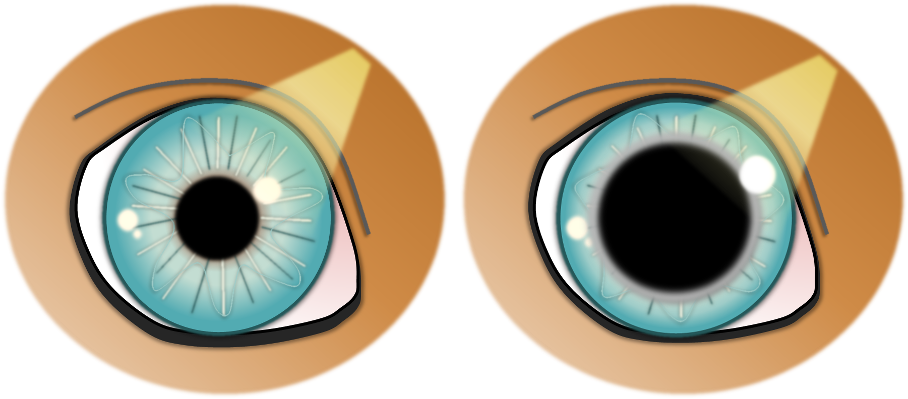

Die Iris oder Regenbogenhaut reguliert die Größe der Pupille und somit den Lichteinfall in das Auge. Bei Lichteinfall verengt sich die Pupille, bei Dunkelheit ist sie weit.

Die Muskulatur der Iris kann im Alter abnehmen (Atrophie). Die Folge ist, dass sich die Pupille immer unvollständiger zusammenziehen kann. Bei fortgeschrittener Atrophie verengt sie sich auch bei sehr hellem Licht gar  nicht mehr.

<!--excerpt-->

## Diagnose

Bei der Augenuntersuchung wird die Irisatrophie anhand typischer Kriterien erkannt und von anderen Erkrankungen unterschieden. Typischerweise erscheint der Rand der Pupille unregelmäßig, wie ‚ausgefranst‘ oder weist im fortgeschrittenen Stadium sogar Löcher auf. 





## Symptome

Neben der weiten Pupille kann bei manchen Tieren eine Lichtempfindlichkeit auffallen. Sie suchen bei Spaziergängen aktiv den Schatten oder blinzeln viel bei Sonnenschein. Eine Beeinträchtigung des Sehvermögens ist bei den meisten Tiere wenig oder überhaupt nicht merklich. 

## Verlauf

Die Irisatrophie beginnt meistens zwischen dem 6. und 8. Lebensjahr und schreitet langsam fort. Besonders deutlich wird sie oft nach dem 10. Lebensjahr. Die Ausprägung und das Fortschreiten sind aber individuell sehr unterschiedlich. In sehr seltenen Fällen kann eine hochgradige Irisatrophie mit einer Linsenlockerung einhergehen. 

## Therapie

Eine Behandlung ist nicht möglich. Die Irisatrophie ist eine normale Alterserscheinung, mit der die meisten Tier gut zurechtkommen. Bei sehr starker Lichtempfindlichkeit kann eine Hundesonnenbrille gute Abhilfe schaffen. Dabei ist besonders auf korrekten Sitz der Brille zu achten.

Häufig fällt eine ebenfalls altersbedingte leichte Eintrübung der Linse (Nukleussklerose) durch die Irisatrophie noch deutlicher auf. Sie tritt meistens in einem ähnlichen Alter auf und ist ebenfalls nicht behandlungsbedürftig.
