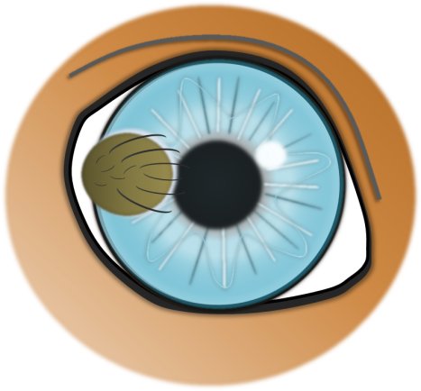
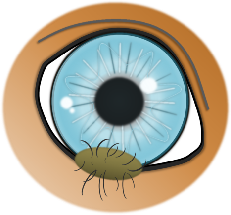
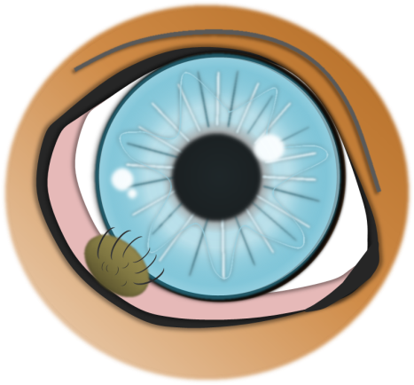

Dermoide sind versprengte Hautinseln (von Derma = Haut), die sich am ‚falschen‘ Ort befinden. Diese Missbildung ist angeboren. 

<!--excerpt-->

Am Auge kommen sie auf der Hornhaut (Abb. 1), dem Lidrand (Abb. 2) oder der Bindehaut (Abb. 3) vor. Sie können zufällig entsehen oder eine erbliche Grundlage haben.













## Symptome / Folgen

Diese Hautinseln sind unterschiedlich stark behaart. Die Haare reiben auf der Augenoberfläche, was zu ständigen Reizungen und Hornhautdefekten führt. Mit der Zeit können bleibende Trübungen der Hornhaut entsehen. Zum anderen stören sie je nach Größe und Lage häufig den korrekten Lidschluss und damit die Benetzung der Hornhaut mit Tränenflüssigkeit.

## Therapie

Dermoide können nur chirurgisch entfernt werden. Hornhautdermoide liegen oberflächlich in der Hornhaut und werden durch eine sog. lamelläre Keratektomie entfernt (Entfernung des dermoidtragenden Hornhautscheibchens). Der verbleibende Hornhautdefekt verheilt anschließend mit medikamenteller Therapie. Nach der Entfernung von Dermoiden der Horn- und Bindehaut ist keine Wundnaht erforderlich. In der Nachbehandlung kommen kortisonhaltigen Augentropfen zum Einsatz. Diese sind notwendig, um überschießende Heilungsreaktionen und Vernarbungen zu reduzieren.

Nach der Entfernung eines Lidranddermoides, muss der Lidrand im Anschluss mit einer speziellen
Naht rekonstruiert werden, deshalb ist bis zum Fädenziehen (8-10 Tage) ein Halskragen erforderlich.

## Prognose

Die Prognose ist sehr gut. Wurde ein Dermoid vollständig entfernt, kann es nicht wiederkommen. Zum Teil bleibt eine leichte Narbenbildung der Hornhaut zurück, die aber das Sehvermögen nicht beeinträchtigt.
