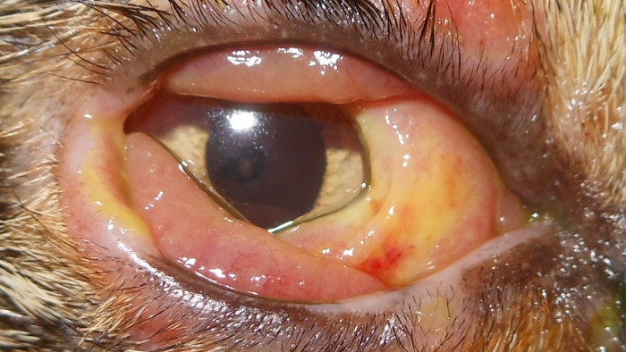
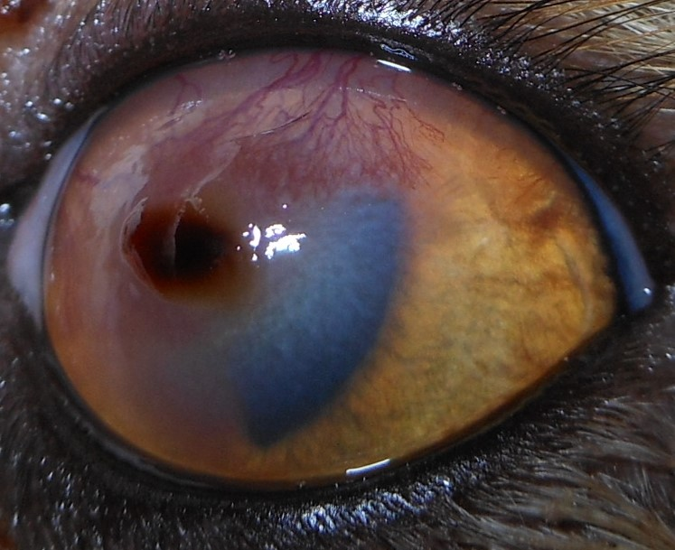
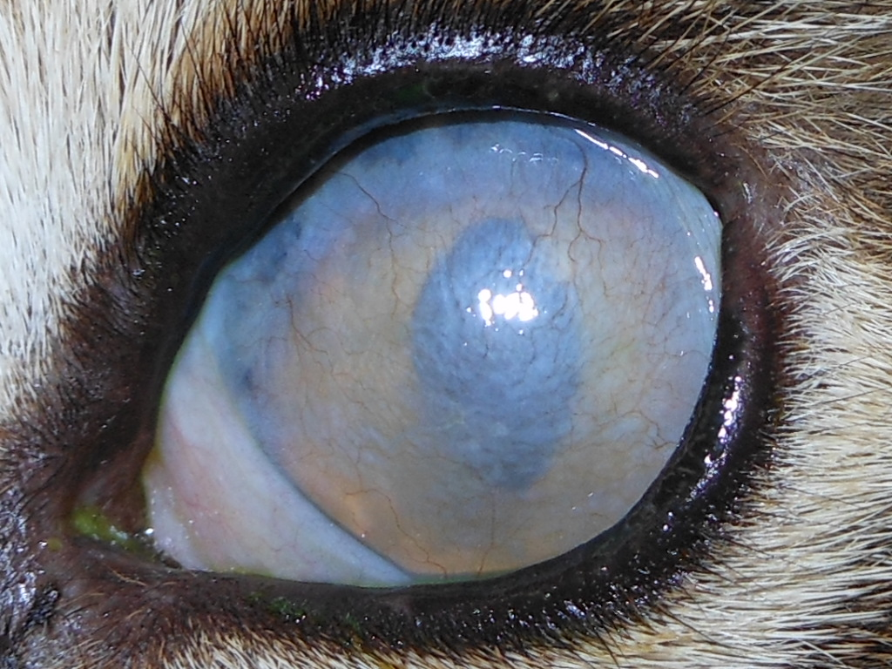

Bindehautentzündungen der Katze werden sehr häufig von viralen und bakteriellen Erregern ausgelöst. Dies sind hauptsächlich Herpesviren (FHV), Chlamydien (Chlamydophila felis, C.felis) und Mycoplasmen (Mycoplasma felis, M.felis). Infektionen mit mehreren Erregern gleichzeitig sind nicht selten.
Das feline Herpesvirus (FHV) kann bei Katzen zu schwerwiegenden und lang anhaltenden Augenproblemen führen. Viele Katzen sind latent mit dem Virus infiziert. Das Virus führt am Auge häufig zu Hornhautentzündungen und –defekten sowie zu Bindehaut- und Lidentzündungen. Die Katzen ziehen sich dieses Virus häufig im Zuge einer Katzenschnupfeninfektion im Welpenalter zu.
Chlamydien und Mykoplasmen sind bakterielle Erreger, die innerhalb der Zellen leben. Sie können Bindehautentzündungen bei Katzen auslösen oder verkomplizieren. Sie sind auch Teil des Katzenschnupfenkomplexes und sind beteiligt an Infekten der oberen Atemwege. Mykoplasma kann mitunter auch zu Gelenkentzündungen führen. Sie finden sich aber auch auf den Schleimhäuten klinisch gesunder Tiere. 

<!--excerpt-->

## AUSLÖSER

Direkter Kontakt ist in der Regel für die Übertragung notwendig. Das Herpesvirus kann längere Zeit in Katzen persistieren ohne Symptome zu verursachen (latent). Intermittierende Virusreaktivierung ist häufig.  
Ein wesentlicher Faktor bei der Entwicklung einer Herpeskeratitis oder -konjunktivitis ist Stress, der das Immunsystem schwächt. Typische Auslöser einer Herpeskeratitis sind eine Zahnsanierung, eine Urlaubsreise der Besitzer, Familienzuwachs oder ein Umzug. Je nach Sensibilität des Tieres können schon kleinere Stressoren wie ein neues Möbelstück ausreichend sein. Auch andere Erkrankungen, die das Wohlbefinden oder Immunsystem beeinträchtigen, wie juckende Hauterkrankungen, Zahnschmerzen, Infektionserkrankungen o.a. können als Auslöser fungieren. 

## SYMPTOME

Betroffene Katzen zeigen häufig eine schnell entstehende Bindehautschwellung, sie kneifen das betroffene Auge zusammen und weisen vermehrten Tränenfluss auf. Die Symptome können sich dann auf beide Augen ausweiten, das ist bei Chlamydophila felis häufig der Fall. Während sich Mycoplasma felis und Chlamydophila felis auf die Bindehaut beschränken, können sich bei Herpesvirusinfekten Hornhauttrübungen und -defekte bemerkbar machen.

Sind nicht nur die Augen betroffen, können auch Niesen und Nasenausfluss hinzukommen (Katzenschnupfen). Dies ist häufig bei Infektionen im Welpenalter der Fall. Besonders sehr junge Katzen zeigen häufig einen schweren Verlauf einer Herpesinfektion im Bereich der Augen mit tiefen Hornhautdefekten, die sogar perforieren können. Außerdem entstehen bei Welpen sehr schnell Verwachsungen der Bindehaut mit sich selbst oder der Hornhaut (Symblepharon). Diese können zu dauerhaften Seheinschränkungen führen. 

## DIAGNOSE

Die Diagnose wird bei der Augenuntersuchung durch die Anamnese und das Erscheinungsbild gestellt. Durch Herpesviren ausgelöste Hornhautdefekte haben häufig ein charakteristisches, verzweigtes Aussehen (dendritischer Defekt). 




Zusätzlich steht ein spezieller Test zur Verfügung (PCR), bei dem die Erreger in einem Augenabstrich bestimmt werden können. Leider kann dieser Test, wenn er negativ ausfällt, eine Herpesinfektion nicht ausschließen. Mykoplasmen und Chlamydien können auch bei gesunden Tieren nachgewiesen werden, sind aber bei Tieren mit Konjunktivitis häufiger anzutreffen.

## THERAPIE

Die Herpeskonjunktivitis (Bindehautentzündung) wird mit antiviralen Medikamenten (Tabletten und/oder Salbe) behandelt. Eine Viruselimination gelingt nicht. Bei sehr jungen Katzen ist das frühzeitige Lösen von Bindehautverklebungen entscheidend, um Verwachsungen zu vermeiden. Erwachsene Katzen neigen deutlich weniger zu diesen Verklebungen. 
Mykoplasmen und Chlamydien sprechen gut auf die Therapie mit speziellen Antibiotika an (Tetrazykline). Um Chlamydien zu eliminieren, müssen diese 4 Wochen verabreicht werden, für Mykoplasmen können 6 Wochen notwendig sein. Bei Tieren im Wachstum und tragenden Tieren müssen andere Antibiotika zum Einsatz kommen, da Tetrazykline nicht gut verträglich sind (Azithromycin, Clindamycin, Marbofloxacin, Pradofloxacin). 

Ein Immunstimulanz kann unter die Haut injiziert und oral verabreicht werden, um die eigene Abwehr zu fördern. 

Liegt ein Hornhautdefekt vor, sind zusätzlich antibiotische Augentropfen ratsam, um eine bakterielle Infektion der Hornhaut zu behandeln oder zu verhindern. Häufig wird mithilfe eines sterilen Wattestäbchens ein kurzes Debridement des Defektes mit lokal betäubenden Augentropfen vorgenommen. Eine Verbandskontaktlinse kann vorübergehend eingesetzt werden. 

Manchmal ist auch ein systemisches Antibiotikum zusätzlich sinnvoll, vor allem bei bestehender Schnupfensymptomatik. 

Stressvermeidung ist ein wesentlicher Bestandteil der Therapie und Prophylaxe! Deshalb wird die Medikamentenfrequenz so niedrig wie möglich gehalten und auch ein Halskragen sollte nur Verwendung finden, wenn die Patienten stark an den Augen reiben. 
Das Nahrungsergänzungsmittel L-Lysin wurde viele Jahre zusätzlich eingesetzt. Neuere Studien zeigen aber, dass es keinen therapeutischen oder prophylaktischen Vorteil hat. 

## KOMPLIKATIONEN

Im Lauf der Herpesinfektion können sich verschiedene Komplikationen entwickeln. 

### _Cornea nigra_ 

Eine recht häufige Komplikation ist die sogenannte Hornhautnekrose. Sie entwickelt sich aus Hornhautdefekten, die im Zuge der Herpeserkrankung lange nicht ausheilen. Sie ist daran zu erkennen, dass sich die Hornhaut im betroffenen Bereich dunkelbraun bis schwarz verfärbt. In diesem Fall ist eine chirurgische Versorgung ratsam.





### _Entropium_ 

Eine ebenfalls häufige Komplikation ist die Einrollung der Lider (Entropium). Dies entsteht durch das schmerzbedingte, spasmusartige Zukneifen der Augenlider. Die infolgedessen auf der Hornhaut reibenden Haare verschlimmern die Situation zusätzlich. Eine chirurgische Korrektur der Augenlider ist notwendig. 





### _Hornhautperforation_ 

Infiziert sich ein oberflächliches Herpesulcus mit Bakterien, vertieft es sich und kann im schlimmsten Fall perforieren. Ein solcher Defekt sollte chirurgisch versorgt werden, da hier das Sehvermögen und der Augenerhalt gefährdet sind. Je nach Ausmaß, kann hier ein Hornhaut- oder Bindehauttransplantat zum Einsatz kommen. 

### _Symblepharon- Bindehautverwachsungen_ 

Vor allem bei Katzenwelpen kann es schnell zu Verwachsungen der Bindehaut mit sich selbst, der Nickhaut oder der Hornhaut kommen. Dies kann, je nach Ausmaß, die Funktion der Lider und das Sehvermögen stark einschränken. Therapeutisch sind diese Verwachsungen nur unvollständig zu beeinflussen. Deshalb ist es besonders bei Welpen wichtig, vorbeugende Maßnahmen zu ergreifen, um das Symblepharon zu verhindern. 





### _Verschluss der Tränenwege_ 

Eine häufige Folge einer Herpesinfektion am Auge im Welpenalter ist, dass die ableitenden Tränenwege nicht mehr durchgängig sind. Dies ist in der Regel eine Folge von Verwachsungen der Bindehaut und oberen Tränenwege bei schwerwiegenden Entzündungen. Die Folge kann ein chronisch tränendes Auge sein. Eine chirurgische Therapie ist leider nicht immer erfolgreich. 

### _Eosinophile Keratitis_ 

Gleichzeitig oder nach überstandener Herpesinfektion kann es zu einer Hornhautentzündung (Keratitis) kommen. Diese wird vom eigenen Immunsystem ausgelöst und aufrecht erhalten. Die eosinophile Keratitis kann schnell fortschreiten und sogar zur Erblindung führen. Sie ist daran zu erkennen, dass eine Hornhauttrübung mit Blutgefäßen und häufig weißen Auflagerungen auf der Hornhaut auftritt. Sie ist nicht schmerzhaft und bedarf einer gesonderten Therapie. 

### _Trockenes Auge_ 

Trockene Augen sind bei Katzen deutlich seltener als beim Hund. Sie treten hier vor allem nach Herpesinfektionen des Auges auf. Deshalb ist es häufig nach überstandenen Infektionen notwendig, noch eine Zeit befeuchtende Augenmedikamente zu verabreichen. 

## PROPHYLAXE

Viele Katzen tragen das Herpesvirus bereits in sich. Enger Kontakt mit erkrankten Tieren sollte aber vermieden werden. Da der Hauptauslöser für eine letztendliche Erkrankung Stress ist, ist Stressvermeidung, soweit möglich, die beste Prophylaxe. Stehen unvermeidliche stressige Situationen wie ein chirurgischer Eingriff, Urlaub, Umzug u.a. bevor, kann im Vorab bereits ein Medikament zur Immunstärkung injiziert werden.
Leider können vorhandene Impfungen für Herpes und Chlamydien die Infektion nicht verhindern, können aber den Krankheitsverlauf mildern. Dies ist besonders wichtig in Katzenzuchten mit Infektionsvorgeschichte. Hier kann eine erneute Impfung vor der Verpaarung in Betracht gezogen werden. Gegen Mykoplasmen steht keine Impfung zur Verfügung. 