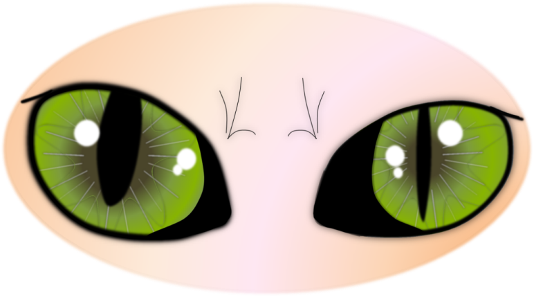
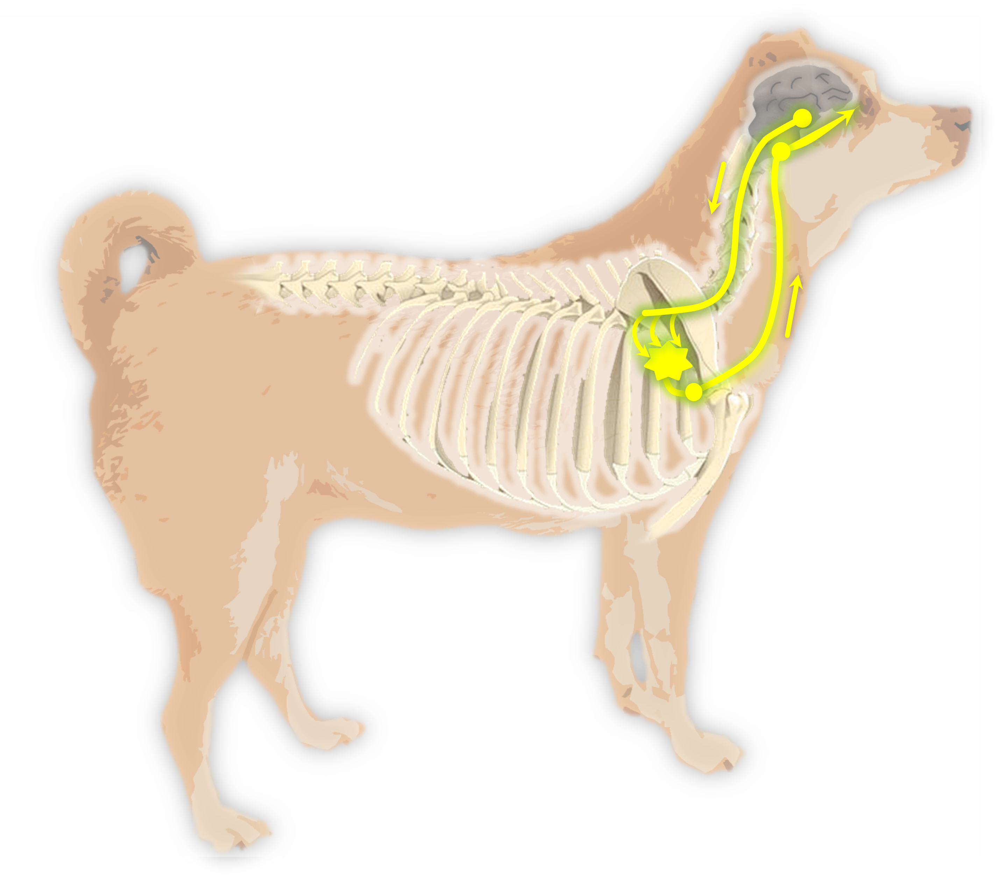

Das Horner Syndrom ist eine Erkrankung der Nervenversorgung des Auges. Das Auge selbst ist gesund. Es fällt die Funktion des Nervus sympathicus teilweise oder vollständig aus. Dieser Nerv ist mitverantwortlich für die Funktion der Pupille, der Lider, der Nickhaut und für die Augapfelposition. Die Erkrankung tritt in der Regel ganz plötzlich auf.

## Symptome

Die Symptome des Horner Syndroms sind typisch und bestehen aus:

- einer engen Pupille (Miosis)
- einem hängenden Oberlid (Ptosis)
- einer vorgefallenen Nickhaut
- einem eingesunkenen Auge (Enophthalmus)

Die Symptome treten in unterschiedlicher Intensität und nicht immer alle gleichzeitig auf. Häufig tränt das betroffene Auge etwas als Begleiterscheinung.





## Ursache

Da der betroffene Nerv einen sehr langen Weg bis zum Auge zurücklegt, sind die möglichen Ursachen äußerst vielfältig. Der Nerv entspringt im Gehirn, verläuft dann innerhalb des Rückenmarks  der  Halswirbelsäule, taucht in den ersten drei Segmenten der Brustwirbelsäule tiefer in das Rückenmark ein und tritt dort im Brustkorb dann aus dem Wirbelkanal aus. Der Nerv läuft nun gemeinsam mit der Halsschlagader (Arteria carotis) Richtung Kopf (Truncus vagosympathicus) bis zu einem Nervenganglion (Ganglion cervicale craniale), das nah am Mittelohr liegt (Bulla tympanica). Danach laufen Fasern des Nerven durch das Mittelohr und gelangen, zusammen mit dem Nervus trigeminus, in die Augenhöhle und zum Auge.

Mögliche Ursachen sind dementsprechend:

- **Gehirn:**
  Entzündungen, Tumoren, Trauma

- **Hals:**
  Trauma, Bandscheibenvorfall, Rückenmarkinfarkte, Bisse, Operationen im Halsbereich, starker Zug am Halsband, Tumoren des Rückenmarks, der Wirbel, der Schilddrüse oder Speicheldrüse

- **Thorax:**
  Trauma, Neoplasie von Wirbelsäule, Rückenmark, Mediastinum, Rückenmarkschäden jeder Art, Schäden am Plexus brachialis (Nervengeflecht für die Versorgung der Vordergliedmaße)

- **Ohr:** 
  Mittelohrentzündung, Polypen v.a.bei Katzen, Operationen, Spülungen

- **Augenhöhle:** 
  Tumor, Abszess, Trauma

- **Infektionen:**
  zB Neospora canis oder Toxoplasma gondii

- **Endokrinopathien:**
  Diabetes mellitus, Schilddrüsenunterfunktion

- **Idiopathisch:**
  Ein hoher Prozentsatz der Horner Syndrome haben keine auffindbare Ursache. Besonders typisch ist diese Form beim Golden Retriever. Diese Horner Syndrome verschwinden meist innerhalb von 4-6 Monaten.





## Diagnose

Die Diagnose wird über die typischen klinischen Symptome und den Ausschluss anderer Augenerkrankungen gestellt. Ein Testverfahren mit Phenylephrin-haltigen Augentropfen kann Hinweise geben, wo im Verlauf der Nervenbahnen die Schädigung lokalisiert ist. Dabei wird die Zeit gemessen, in der nach Verabreichung der Augentropfen die Symptome des Horner Syndroms verschwinden. Je weiter die Läsion vom Auge im Verlauf des Nerven  entfernt gelegen ist, desto größer ist die Zeitspanne. 

Anschließend ist eine allgemeine und neurologische Untersuchung des Patienten sowie eine Ohruntersuchung sinnvoll. Auch eine Blutuntersuchung mit Bestimmung der Schilddrüsenfunktion ist empfehlenswert. Weiterhin kann eine Röntgenuntersuchung von Thorax und Halsbereich leicht durchgeführt werden und aufschlussreich sein. Bleibt die Ursache dennoch ungeklärt, kann eine CT-Untersuchung weitere Informationen, v.a. über das Mittelohr, geben. 

## Therapie

Die Therapie richtet sich nach der Ursache des Horner Syndroms. Das idiopathische Horner Syndrom bedarf keiner Therapie. Wenn der Nickhautvorfall aber so ausgeprägt ist, dass er das Sehen stört, können phenylephrinhaltige Augentropfen längerfristig zur Linderung der Symptome verabreicht werden. Auch Vitamin-B-haltige Präparate können oral unterstützend eingesetzt werden. 
 
