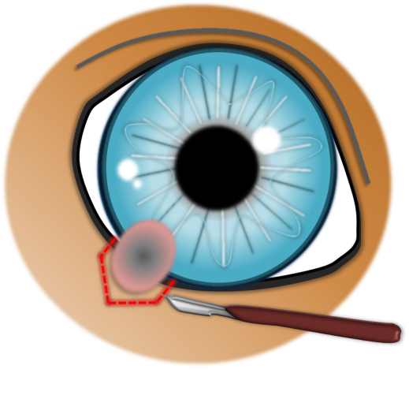
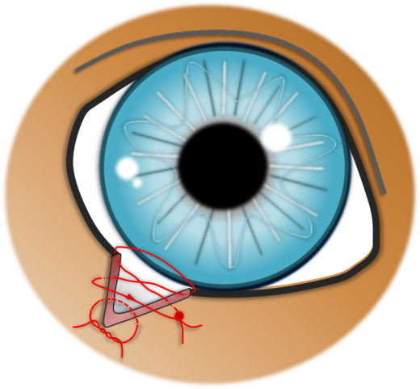
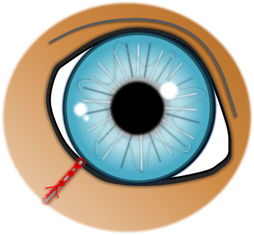

Lidrandtumore sind i.d.R. gutartige Tumoren, die direkt am Lidrand sitzen und häufig auf der Hornhaut reiben.  

## Ursache

Die Lidrandtumoren entstehen aus den sog. Meibomdrüsen im Lid. Die Ausführungsgänge dieser Drüsen sind als kleine Pünktchen auf dem Lidrand sichtbar. Sie produzieren ein talgiges Sekret, das für die Funktion des Tränenfilms unerlässlich ist. Lidrandtumore sind eine häufige Erkrankung bei mittelalten bis alten Hunden. Auch sehr junge Hunde können schon Lidrandtumore bekommen. Dabei handelt es sich häufig um Warzen (Papillome), die durch ein Virus ausgelöst werden können. Zu über 95% sind Lidrandtumore gutartig. 

## Symptome

In der Regel fällt dem Besitzer eine kleine oder größere Umfangsvermehrung auf, die am Lidrand sitzt. Anfänglich verursachen die kleinen Tumore häufig noch keine oder wenig Beschwerden in Form von leicht vermehrtem Augenausfluss und Rötung. Wenn sie größer werden und auf der Hornhaut reiben, kommt es oft zu Reizerscheinungen, Hornhautentzündungen und sogar Hornhautdefekten. Letzteres ist sehr schmerzhaft und die Patienten kneifen das Auge zusammen und zeigen vermehrten Augenausfluss.  

## Diagnose

Die Diagnose wird bei der Augenuntersuchung durch das typische Erscheinungsbild gestellt. Nicht jede Umfangsvermehrung am Lid ist auch ein Tumor.  Fokale Entzündungen in Form von Gersten- (Hordeolum ) und Hagelkörnern (Chalazion) sind ebenfalls häufig.   

## Therapie 

Lidrandtumore können durch einen kleinen chirurgischen Eingriff vollständig entfernt werden. Das Lid wird mit einer speziellen Naht verschlossen, die gewährleistet, dass eine stufenfreie Heilung eintritt. 
Die chirurgische Entfernung ist die optimale Therapie für einen Lidrandtumor. Liegen Gründe vor, die gegen eine  Narkose des  Tieres sprechen (kranke oder sehr alte Tiere),  ist eine alternative Therapie am wachen Patienten mit dem Ziel der Wachstumskontrolle möglich. Hierbei wird nur der überstehende Tumorteil in Lokalanästhesie entfernt. Dies kann mit einer Kryotherapie kombiniert werden, um das Wachstum des im Lid verbleibenden Tumorrestes zu ermöglichen.

## Prognose

Der größte Teil der Lidrandtumore ist gutartig. Bei vollständiger Entfernung werden sie nicht nachwachsen. An anderer Stelle des Lidrandes können natürlich weiterhin Lidrandtumore entstehen. Lediglich bösartige Tumore sind  mit dem Risiko eines Wiederwachstums assoziiert. Eine pathologische Untersuchung des entfernten Tumors kann Gewissheit über dessen Eigenschaften und die vollständige Entfernung geben. 

## OP des Lidrandtumors











