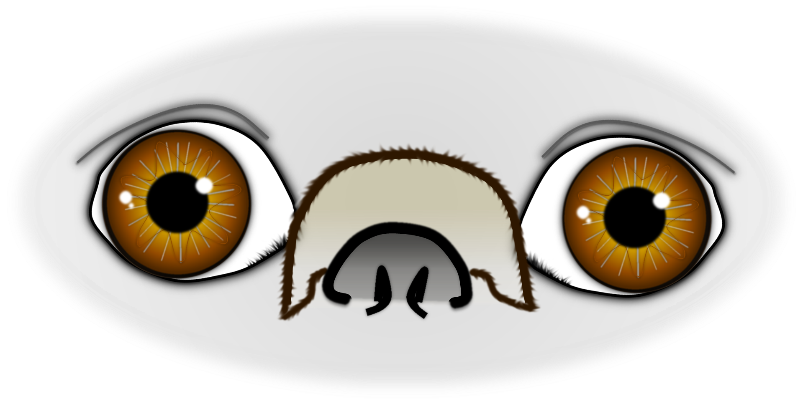
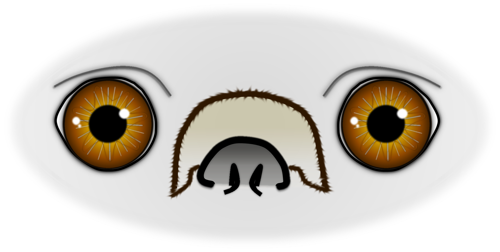

# Zu große Lidspalte, trockenes Auge und Hornhautpigmentierung beim Mops und anderen kurznasigen Hunderassen
## - Ursachen, medikamentelle und chirurgische Therapie -

Die Augenlider des Mopses und vieler anderer kurznasiger Hunderassen (Französische Bulldogge, Shih Tzu, Pekingese u.a.) sind zu lang und umschließen die Augen nur unvollständig. Außerdem stehen die Augen weiter vor als bei langnasigen Hunden. Durch diese Konstellation sind die Augen bei diesen Rassen nahezu ungeschützt den Umwelteinflüssen ausgesetzt. 

## Problemkomplex beim brachyzephalen Hund

Vor allem beim Mops liegt eine Kombination von Problemen vor:

***Makroblepharon***: 
Die Augenlider sind zu lang und schließen nicht richtig. Dadurch wird die Augenoberfläche unvollständig mit Tränenenflüssigkeit befeuchtet und trocknet aus.

***Exophthalmus***: 
Die Augen stehen durch eine sehr flache Augenhöhle vor und sind deshalb Umwelteinflüssen wie Wind und Staub besonders stark ausgesetzt.

***Entropium***: 
Sehr häufig ist das untere nasale Augenlid nach innen eingerollt. Dadurch reiben Haare auf der Hornhaut.

***Trockenes Auge***: 
Entweder ist die Tränenflüssigkeit zu wenig oder, viel häufiger, falsch zusammengesetzt. In beiden Fällen bleibt die Augenoberfläche zu trocken. Ein typisches Symptom ist zäher, gräulicher oder teilweise gelblicher Schleim in den Augen.

Die Kombination aus diesen Fehlfunktionen kann von der  Hornhaut nur für einen begrenzten Zeitraum ausgeglichen werden. Danach kommt es zu sichtbaren Schäden mit chronischen Entzündungen, Hornhautdefekten und Hornhautpigmentierungen.
Ein schwerwiegendes Ereignis, das besonders brachyzephale Hunde trifft, ist der Bulbusprolaps (Augenvorfall). Durch ein meist stumpfes Trauma am Kopf, kann es zu einem Vorfall des gesamten Auges aus der Augenhöhle kommen. Die sehr flache Augenhöhle der kurznasigen Hunde  begünstigt zusammen mit der weiten Lidspalte den Bulbusprolaps außerordentlich. Die betroffenen Augen haben ein sehr hohes Erblindungsrisiko.                                                

## Keratitis pigmentosa

Eine häufige Folgeerscheinung der chronischen Reizung und Entzündung ist dunkelbraunes Pigment, das sich auf der Augenoberfläche bildet. Es breitet sich von nasal mehr und mehr über die gesamte Hornhaut aus. Im Laufe der Zeit kann es zu Sehstörungen und in Extremfällen zur vollständigen Erblindung kommen. 

## Medikamentelle Behandlung

Mit Augenmedikamenten können das trockene Auge und die Keratitis pigmentosa beeinflusst werden. Die Behandlung muss lebenslang erfolgen, das Absetzen der Augenmedikamente führt zur Wiederverschlechterung. Je nach Schweregrad der Erkrankung, stehen Medikamente zur Verfügung, die die Zusammensetzung des Tränenfilms verbessern und die Tränenmenge erhöhen können. Gleichzeitig wird häufig eine Reduktion der Pigmentierung erreicht. Bei manchen Patienten ist die medikamentelle Therapie aber nicht ausreichend.

## Chirurgische Behandlung - nasale Kanthusplastik

In einer Operation können die Lider gekürzt und die Einrollung behoben werden. Die nun kleinere Lidspalte schützt die Augen deutlich besser, die Augenoberfläche wird besser mit Tränenflüssigkeit benetzt und es berührt kein Fell mehr die Hornhaut.  Durch den chirurgischen Eingriff verändert sich auch der Gesichtsausdruck des Hundes ein wenig, die Lider sind kürzer und die Augen dadurch weniger vorstehend und kleiner. Auch die Gefahr eines Bulbusprolaps ist nun deutlich geringer.
Gleichzeitig kann in der Operation eine sogenannte Kryotherapie (Kältetherapie) das vorhandene Pigment reduzieren. 
Zusätzlich zur Operation ist in den meisten Fällen eine dauerhafte Gabe von Augentropfen sinnvoll, um einen möglichst lebenslangen Erfolg zu erreichen.







