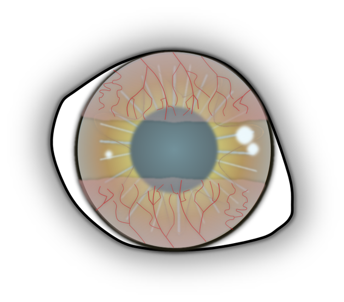
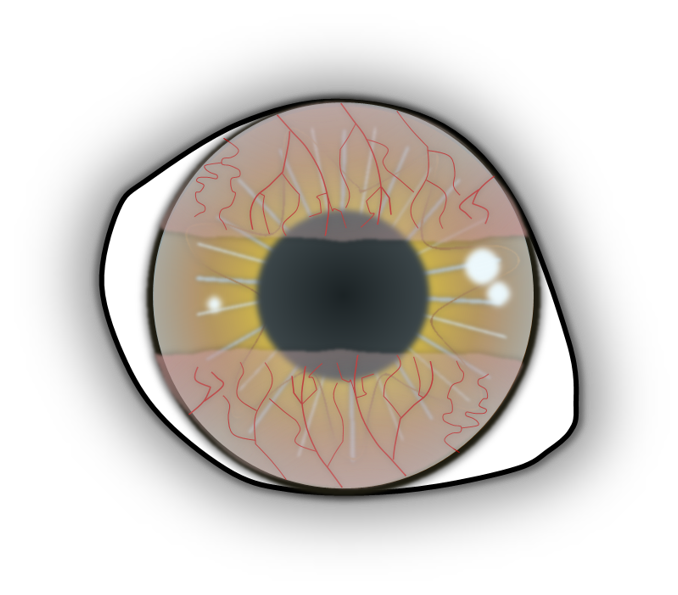

Die Endotheldystrophie ist eine Erkrankung, bei der sich die Hornhaut Ihres Hundes langsam eintrübt. Diese Erkrankung betrifft v.a. die älteren Tiere. Einige Rassen sind häufiger betroffen als andere wie Dackel und Boston Terrier. 

## Auslöser

Die Endothelzellen kleiden die Innenfläche der Hornhaut aus. Ihre Aufgabe ist es, Flüssigkeit aus der Hornhaut zu ‚pumpen‘, so dass sie transparent und dünn (ca. 0,5 mm) bleibt. Bei einer Endotheldystrophie sind diese Zellen stark reduziert. Hornhautendothelzellen können sich leider nicht regenerieren. Die verbleibenden Zellen können sich nur vergrößern und so versuchen den Verlust teilweise auszugleichen. Irgendwann dringt dann mehr und mehr Flüssigkeit des Auges in die normalerweise klare Hornhaut ein, sie quillt auf und dadurch entsteht eine Trübung, ein sogenanntes Hornhautödem.                                                

## Ursache

Die Erkrankung tritt bei einigen Rassen erblich auf. Ein gewisser Zellverlust im Alter tritt ohnehin auf. Auch vorausgehende Entzündungen des inneren Auges (Uveitis) oder Operationen am inneren Auge können den Zellverlust verstärken oder verursachen.

## Symptome

Das erste Symptom ist eine zarte Eintrübung zumeist im äußeren (temporalen) Bereich der Hornhaut. Mit der Zeit verstärkt sich die bläuliche Eintrübung und umfasst irgendwann die gesamte Hornhaut. Dies kann Monate oder sogar Jahre dauern. Am Anfang treten keine Beschwerden auf. Mit der Zeit können sich aber auf der Außenseite der Hornhaut Bläschen (Bullae) bilden. Reißen diese auf, entsteht ein schmerzhaftes Hornhautulcus. Dies führt zum Zukneifen des Auges und Tränen. Diese Hornhautdefekte heilen meist schlecht.













## Diagnose

Die Diagnose wird bei der Augenuntersuchung durch das typische Erscheinungsbild gestellt. 

## Therapie

Die Erkrankung ist leider nicht heilbar, eine völlig klare Hornhaut kann mit keiner Therapieoption erreicht werden. Ziel der Behandlung ist es, das Fortschreiten zu verlangsamen und Schmerzen durch reißende Blasen zu verhindern. Die Therapie erfolgt in der Regel initial medikamentell mit hyperosmolaren Augentropfen. Diese sollen das Ödem reduzieren und die Blasenbildung verhindern oder reduzieren. Die Wirksamkeit dieser Tropfen ist begrenzt.
Eine bewährte operative Methode ist der Gundersen-Flap. Dabei wird ein hauchdünnes Bindehauttransplantat in die Hornhaut eingenäht. Die zentrale Hornhaut bleibt dabei frei, um das Sehen nicht zu stören. Die Bindehaut übernimmt nun die Aufgabe der fehlenden Endothelzellen und entfernt Flüssigkeit aus der Hornhaut. Die Hornhaut wird dünner sowie transparenter und die Bildung neuer Blasen wird wirksam verhindert. Grundsätzlich ist diese Methode schon im frühen Stadium sinnvoll, um ein Fortschreiten der Erkrankung zu begrenzen und die Erblindung, wie sie oft im Endstadium auftritt, zu verhindern. Spätestens bei wiederkehrenden Hornhautdefekten ist ein chirurgisches Vorgehen sehr ratsam, um dem Patienten dauerhafte Schmerzfreiheit zu ermöglichen. 









## Prognose

Bei frühzeitiger Erkennung und Behandlung ist die Erkrankung sehr gut kontrollierbar. Heilbar ist sie leider nicht. Unbehandelt führt sie meistens zu starker Seheinschränkung und schmerzhaften Hornhautdefekten.  