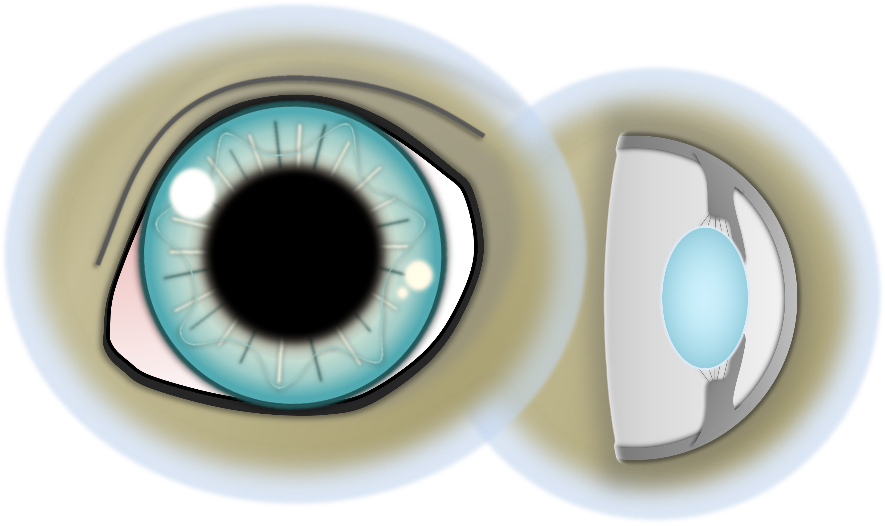

Der Nukleus ist der Kern der Augenlinse.
Er wird umgeben von der Linsenrinde (Kortex).
Bei der Nukleussklerose handelt es sich um eine Verdichtung des Linsenkerns (Sklerose = Härtung).

<!--excerpt-->

## Ursache

Die Veränderung des Linsenkerns ist rein altersassoziiert. Sie beginnt idR um das 6. Lebensjahr herum und ist nach dem 10. Lebensjahr sehr deutlich erkennbar. Die Linse bildet Linsenfasern ein Leben lang nach, ohne dass die Linsengröße zunimmt. Man geht davon aus, dass dies zu einer Kompression und Härtung des Linsenkerns führt. 

## Symptome

Das typische Erscheinungsbild ist eine Trübung im Zentrum der Linse (Linsenkern). Bei Hunden, die älter als 10 Jahre sind, fällt ein Grauschleier in der Pupille in Abhängigkeit von den Lichtverhältnissen auf. Das Sehvermögen wird nicht merklich beeinträchtigt. Lediglich eine sehr fortgeschrittene Sklerose bei sehr alten Hunden kann manchmal zu Seheinschränkungen führen.









## Diagnose

Die Diagnose wird bei der Augenuntersuchung durch das typische Erscheinungsbild gestellt. Hierbei wird das Auge mit weitgestellter Pupille untersucht, um eine Nukleussklerose von einem grauen Star abzugrenzen.  

## Therapie

Eine Therapie ist nicht notwendig. Selten kann bei sehr dichten Linsen in fortgeschrittenem Alter eine Linsenoperation sinnvoll sein. 
