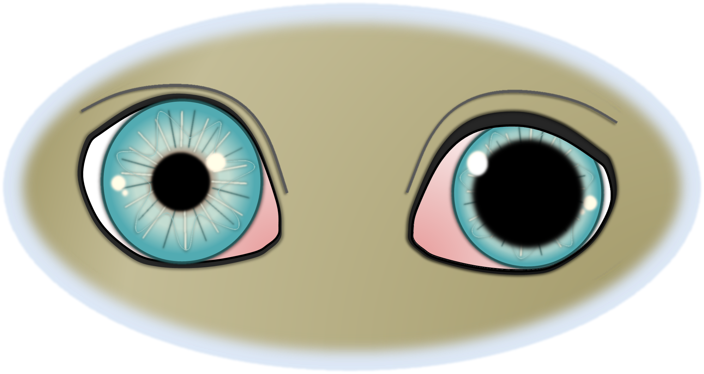

Die Ophthalmoplegie (‚Augenmuskellähmung‘) ist eine Störung der Nervenversorgung der Augenmuskeln. Der III. Hirnnerv, Nervus oculomotorius, weist eine Funktionsstörung auf. Dieser Nerv versorgt sowohl den Pupillenschließmuskel (Musculus sphincter pupillae) als auch äußere Augenmuskeln, die für die Bewegung des Augapfels verantwortlich sind.





## Symptome

Die Symptome hängen von der Lokalisation der Nervenschädigung ab. Bei der inneren Lähmung (Ophthalmoplegia interna) ist die Pupille der betroffenen Seite weit und lichtstarr. 
Sind zusätzlich die äußeren Augenmuskleln, die für die Bewegung des Augapfels zuständig sind, betroffen (Ophthalmoplegia externa), bewegt sich der Augapfel nicht mehr. Außerdem steht das Auge häufig etwas vor (Exophthalmus) und schielt nach außen (Strabismus) und das Oberlid hängt ein wenig (Ptosis). In diesem Fall liegt eine vollständige Lähmung vor.  

## Diagnose

Bei der Augenuntersuchung wird die Augenlähmung anhand typischer Kriterien erkannt. Um die Nervenschädigung von einer Irisatrophie zu unterscheiden, kann ein pharmakologischer Test mit verdünnten Pilocarpin-Augentropfen helfen. Auf der Suche nach der Ursache schließen sich häufig weitere Untersuchungen an, beispielsweise Blutuntersuchungen, ein Bauchultraschall, ein Kopf-MRT usw.  

## Ursache

Die Ursachen sind vielfältig. Neben toxischen Einflüssen durch beispielsweisen Kontakt zu bestimmten Pflanzenarten/Blumen, kommen entzündliche und infektiöse Erkrankungen des zentralen Nervensystems (beispielsweise Fip oder FeLV bei Katzen) infrage. Sehr viel häufiger ist eine Tumorerkrankung des Gehirns ursächlich für die Lähmung. Oft tritt die Erkrankung im Zuge des sogenannten Sinus cavernosus Syndroms oder Fissura orbitalis Syndroms auf, wo neben der Augenlähmung  weitere Störungen auffallen (beispielsweise ausgefallene Hornhautsensitivität oder Gesichtssensitivität, Lethargie, vermehrtes Trinken, Verhaltensänderungen…). Auch sogenannte idiopathische Lähmungen/Neuropathien sind nicht selten, d.h. die Ursache bleibt ungeklärt und die Symptome bessern sich von selbst. Diese Patienten haben keine zusätzlichen neurologischen Auffälligkeiten.

## Therapie

Die Therapie richtet sich nach der Ursache der Erkrankung und ist deshalb von Fall zu Fall verschieden. Oft ist eine symptomatische Therapie des Auges mit befeuchtenden Augentropfen sinnvoll.  
