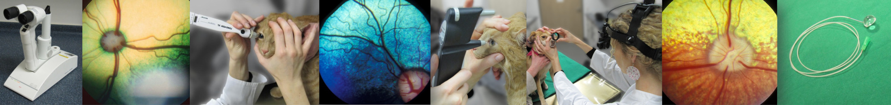

Jede Augenuntersuchung startet mit Funktionstests.

<!--excerpt-->

## Sehtest

Mit der DROHREAKTION kann das Sehen der Augen einzeln überprüft werden. 
Nähert sich die Hand dem Auge, wird es geschlossen. Das andere Auge wird abgedeckt, damit nicht geschummelt werden kann.







Ein weiterer Test ist z.B. der WATTEBAUSCHTEST. 
Es wird überprüft, ob der Patient der fallenden Watte hinterherschaut.
Dieser Test kann aber bei desinteressierten oder sehr aufgeregten Tieren unbrauchbar sein.







Weitere Sehtests, die beim Tier im Zweifel zum Einsatz kommen können, sind die Tischkantenprobe und der Hindernisparcour.

## Pupillarreflex

Die Pupillenreaktion auf Licht gibt wichtige Hinweise auf mögliche Erkrankungen. 
Im Normalfall verengt sich sowohl die direkt beleuchtete Pupille (direkter Reflex) als auch die Pupille der anderen Seite (indirekter Reflex).
Ein normaler Pupillarreflex beweist aber nicht, dass der Patient sieht!







## Blendreflex (Dazzle)

Der Blendreflex überprüft die Reaktion auf helles Licht. Normal ist es, dass der Patient beide Augen geblendet zusammenkneift.
Dieser Test gibt zusätzliche Informationen über die Funktionsfähigkeit der Strukturen von den Augen bis knapp unterhalb der Sehrinde des Gehirns.
Ein Patient mit gutem Blendreflex muss nicht zwangsläufig sehen!







An die Funktionstests schließt sich nun die 'eigentliche' Augenuntersuchung an. 

## Spaltlampenuntersuchung

Die Spaltlampe ermöglicht eine stark vergrößerte Ansicht der einzelnen Augenabschnitte- wie ein Mikroskop. 
Auch sehr kleine Veränderungen können so gut beurteilt und genau lokalisiert werden.
Die Spaltlampe heißt so, weil sie durch ihr spaltförmiges Licht ein optisches „In-Scheiben-Schneiden“ des Auges ermöglicht.
Dadurch können Veränderungen exakt zugeordnet werden (z.B. Trübung der Linse, der Vorderkammer oder der Hornhaut).

























Mit der Spaltlampe wird das Kammerwasser beurteilt. Das Kammerwasser ist normalerweise klar und nicht zu sehen im Spaltlicht. Bei Entzündungen des inneren Auges (Regenbogenhautentzündung) wird das Kammerwasser trüb und streut das Licht (ähnlich Sonnenstrahlen in der Luft). Es wird plötzlich sichtbar (Pfeile). 

## Untersuchung der Netzhaut

Die Netzhaut (Retina) wird mit der sogenannten Spiegelung (indirekte Ophthalmoskopie) untersucht. Dafür werden spezielle Linsen verwandt. Um die gesamte Netzhaut einsehen zu können, müssen die Pupillen mit Augentropfen weit gestellt werden.







Die Untersuchung der Netzhaut dient beispielsweise dazu Entzündungen, Degenerationen, Ablösungen oder auch Blutungen in diesem Bereich zu sehen. Sie ist aber natürlich auch Teil von Vorsorgeuntersuchungen.













## Augeninnendruckmessung - Tonometrie

Die Tonometrie ist die Messung des inneren Augendrucks. Sie erfolgt mit speziellen Geräten sog. Tonometern und dient vor allem der Diagnose des Glaukoms (grüner Star) und ist ein wichtiger Teil der Augenuntersuchung.
Ist der Druck zu hoch, hat Ihr Tier einen sog. Grünen Star (Glaukom). Ein zu niedriger Druck hingegen, tritt bei Entzündungen des inneren Auges auf (Uveitis).













## Überprüfung der Tränenproduktion mit dem Schirmer Tränentest (STT)

Die Tränenproduktion wird mit speziellen Papierstreifen überprüft (Schirmer Tränentest). So kann ein trockenes Auge erkannt werden. Die Teststreifen werden in das Unterlid eingehängt und nehmen die gebildete Tränenmenge (den sog. Reiztränenfluss) auf. Auf der Skala kann dann der erreichte Wert abgelesen werden.



















## Fluoreszeintest

Die Augenoberfläche, also die Hornhaut und Bindehaut, kann mit einem Farbstoff dem sog. Fluoreszein beurteilt werden. Liegt ein Hornhaut- oder Bindehautdefekt vor, färbt dieser sich gelbgrün. Aber auch eine raue, unebene Hornhautoberfläche kann mithilfe von Fluoreszein erkannt werden. In diesem Fall haftet der Farbstoff diffus auf der (normalerweise glatten) Oberfläche.



















## Untersuchung der Tränenwege

Häufig stellt sich die Frage, ob die tränenableitenden Wege unserer Patienten durchgängig sind oder ein Verschluss vorliegt. Das geht mithilfe des Farbstoffs Fluoreszein. Gibt man ihn in die Augen, fließt er über die Tränenpunkte in den Lidern über den Tränennasengang in die Nase ab und kann dann an den Nasenöffnungen gesehen werden (Jones Test 1). 







Häufig ist zusätzlich die Spülung der Tränenwege notwendig, um ihre Durchgängigkeit endgültig festzustellen. Hierfür werden, nach lokalen Betäubungstropfen, spezielle Sonden in die Tränenpunkte eingeführt und Flüssigkeit in die Tränenwege gegeben. Danach wird überprüft, ob Flüssigkeit aus den Nasenöffnungn austritt. Der Test wird in der Regel gut toleriert.













## Untersuchung der Nickhaut

Unsere Haustiere haben ein Augenlid mehr als wir, das dritte Augenlid oder Nickhaut. Dahinter verstecken sich häufig Fremdkörper, die bei der Untersuchung nicht übersehen werden dürfen. Nach Eingabe von lokal betäubenden Augentropfen wird die Nickhaut mit einer speziellen Pinzette (z.B. Gräfe-Pinzette) vorgezogen und kann genau untersucht werden.













## Augenultraschall

Ist der direkte Einblick in das innere Auge durch starke Trübungen nicht möglich, kommt der Augenultraschall zum Einsatz.
Er wird beim grauen Star vor der Operation regelmäßig durchgeführt. Für den Ultraschall wird die Hornhaut mit Tropfen betäubt.
Anschließend wird der Schallkopf mit einem Ultraschallgel auf die Augenoberfläche gebracht und die Untersuchung des inneren Auges ist möglich.







## Gonioskopie

Die Gonioskopie ist die Kammerwinkeluntersuchung. Der Kammerwinkel ist der Abflussort für das ständig neu gebildete Kammerwasser und befindet sich zwischen Hornhaut und Iris. Es werden spezielle Linsen unter lokal betäubenden Augentropfen auf das Auge aufgebracht, die dann den Einblick in diesen Winkel erlauben. 
Die Untersuchung des Kammerwinkels spielt vor allem beim Glaukom (grüner Star) eine wesentliche Rolle.  Missbildungen in diesem Bereich können (bei manchen Rassen besonders) zu einem hohen Augeninnendruck führen.







## ERG- Elektroretinogramm

Das ERG (Elektroretinogramm) ist ein Funktionstest der Netzhaut. Dabei werden Lichtblitze ins Auge geleitet und Elektroden leiten die Antwort der Netzhaut auf den Lichtreiz ab. Die angezeigte Kurve lässt eine Aussage über die Funktionsfähigkeit der Retina zu. Das ERG kommt vor allem vor Operationen des grauen Stares zum Einsatz. Außerdem erlaubt es häufig die Unterscheidung zwischen okulärer und zentraler Blindheit, also ob die Blindheit durch einen Funktionsverlust der Netzhaut zustande kommt oder die Ursachen eher im Bereich der Sehnerven und des Gehirns zu suchen sind. 





