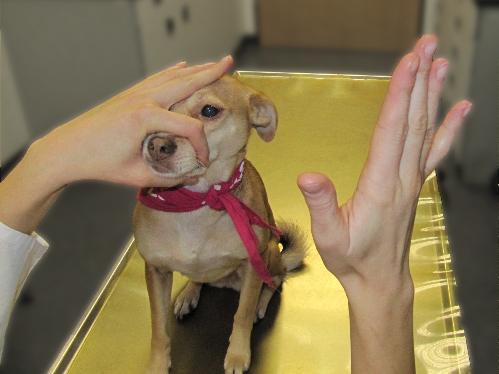
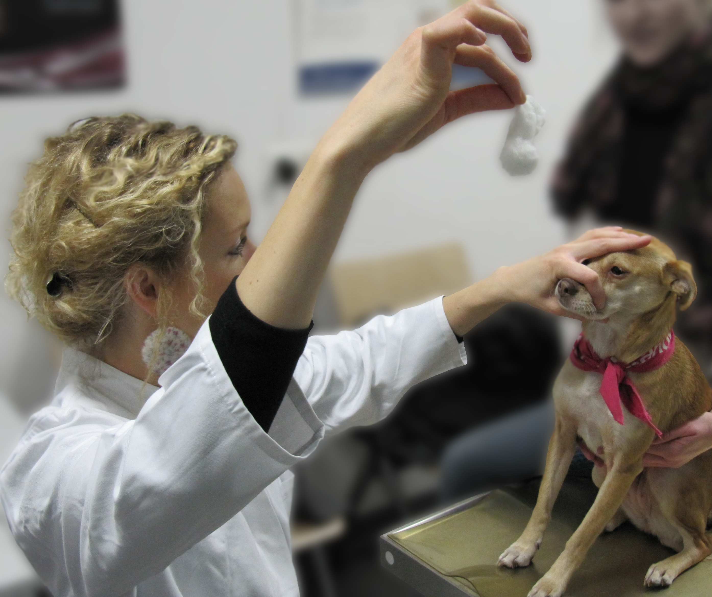
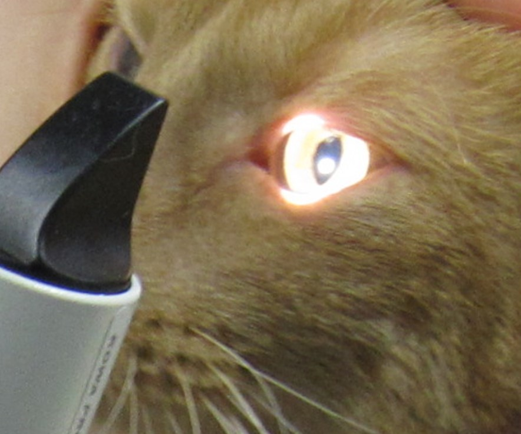
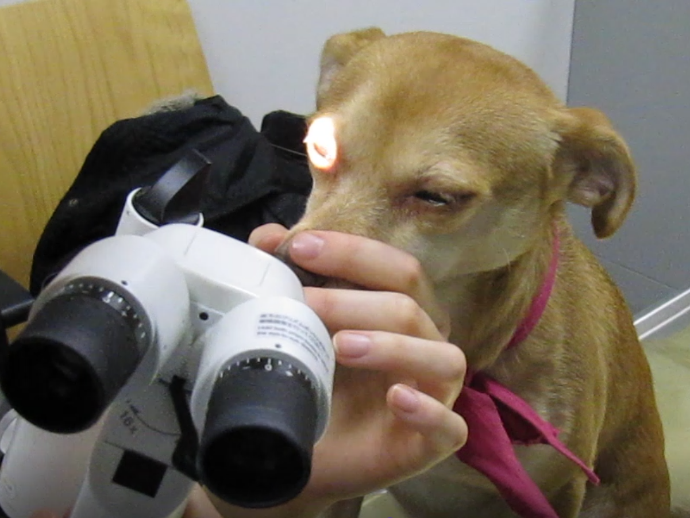
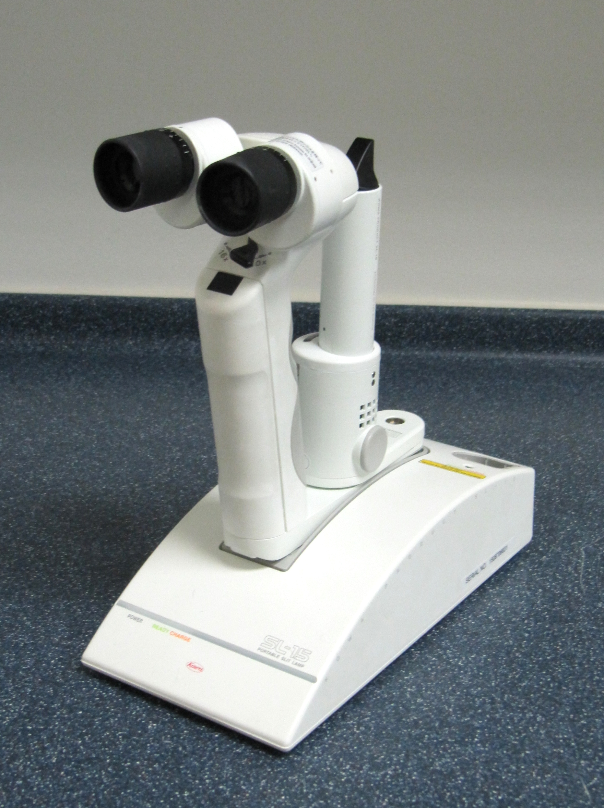
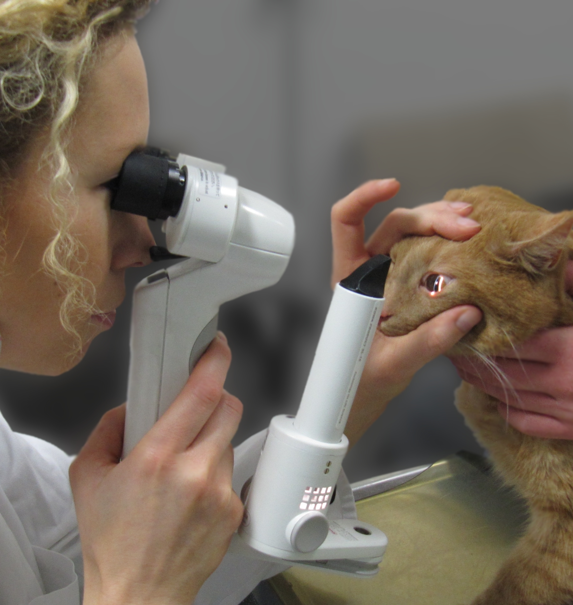

Jede Augenuntersuchung startet mit Funktionstests.

<!--excerpt-->

## Sehtest

Mit der DROHREAKTION kann das Sehen der Augen einzeln überprüft werden. 
Nähert sich die Hand dem Auge, wird es geschlossen. Das andere Auge wird abgedeckt, damit nicht geschummelt werden kann.




Ein weiterer Test ist z.B. der WATTEBAUSCHTEST. 
Es wird überprüft, ob der Patient der fallenden Watte hinterherschaut.
Dieser Test kann aber bei desinteressierten oder sehr aufgeregten Tieren unbrauchbar sein.




 Weitere Sehtests, die beim Tier im Zweifel zum Einsatz kommen können, sind die Tischkantenprobe und der Hindernisparcour.

## Pupillarreflex

Die Pupillenreaktion auf Licht gibt wichtige Hinweise auf mögliche Erkrankungen. 
Im Normalfall verengt sich sowohl die direkt beleuchtete Pupille (direkter Reflex) als auch die Pupille der anderen Seite (indirekter Reflex).
Ein normaler Pupillarreflex beweist aber nicht, dass der Patient sieht!





## Blendreflex (Dazzle)

Der Blendreflex überprüft die Reaktion auf helles Licht. Normal ist es, dass der Patient beide Augen geblendet zusammenkneift.
Dieser Test gibt zusätzliche Informationen über die Funktionsfähigkeit der Strukturen von den Augen bis knapp unterhalb der Sehrinde des Gehirns.
Ein Patient mit gutem Blendreflex muss nicht zwangsläufig sehen!





An die Funktionstests schließt sich nun die 'eigentliche' Augenuntersuchung an. 

## Spaltlampenuntersuchung

Die Spaltlampe ermöglicht eine stark vergrößerte Ansicht der einzelnen Augenabschnitte- wie ein Mikroskop. 
Auch sehr kleine Veränderungen können so gut beurteilt und genau lokalisiert werden.
Die Spaltlampe heißt so, weil sie durch ihr spaltförmiges Licht ein optisches „In-Scheiben-Schneiden“ des Auges ermöglicht.
Dadurch können Veränderungen exakt zugeordnet werden (z.B. Trübung der Linse, der Vorderkammer oder der Hornhaut).

















Mit der Spaltlampe wird das Kammerwasser beurteilt. Das Kammerwasser ist normalerweise klar und nicht zu sehen im Spaltlicht. Bei Entzündungen des inneren Auges (Regenbogenhautentzündung) wird das Kammerwasser trüb und streut das Licht (ähnlich Sonnenstrahlen in der Luft). Es wird plötzlich sichtbar (Pfeile). 
