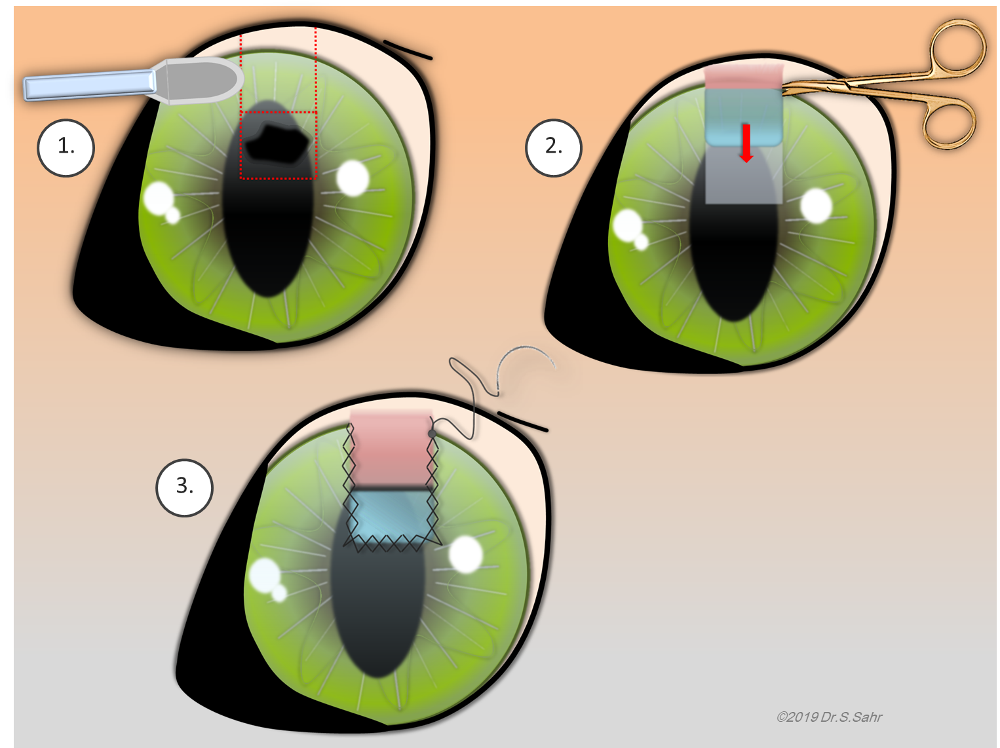

Die 6jährige Exotic Shorthair Katze Abby kam mit einer schmerzhaften Erkrankung der Hornhaut zu uns, die wir häufig bei kurznasigen Katzenrassen sehen, der __Cornea nigra__. Cornea nigra bedeutet übersetzt schwarze Hornhaut. Dabei sterben Teile der Hornhaut ab und verfärben sich dunkel, auch _Nekrose_ oder _Sequester_ genannt. 

<!--excerpt-->





## Abby musste operiert werden.

Abbys Auge war sehr schmerzhaft und der Sequester war so tief, dass schon Kammerwasser auslief (Perforation). So ein Zustand kann zum Verlust des Auges führen. Abby musste deshalb operiert werden.

Dabei wurde die abgestorbene Hornhaut entfernt und das fehlende Areal durch ein Transplantat ersetzt. Bei Abby kam die sog. Hornhaut-Bindehaut-Verschiebeplastik (CCT) zum Einsatz. Dabei wurden benachbarte, gesunde Hornhautanteile für das Auffüllen des erkrankten Areals verwendet und in dieses hineingeschoben. Die Spenderstelle wird mit Bindehaut aufgefüllt. Der Vorteil dieser Operationsmethode gegenüber dem herkömmlichen Bindehauttransplantat liegt darin, dass das Zentrum der Hornhaut wieder sehr klar wird und die Katze keine Seheinschränkung davonträgt. 





## Wie geht es Abby?

Abbys Hornhaut ist gut verheilt. Die Heilungsphase dauert ca. 3 Wochen. Einige Monate später ist das Auge so klar geworden, dass man auf den ersten Blick überhaupt nichts mehr sieht.







