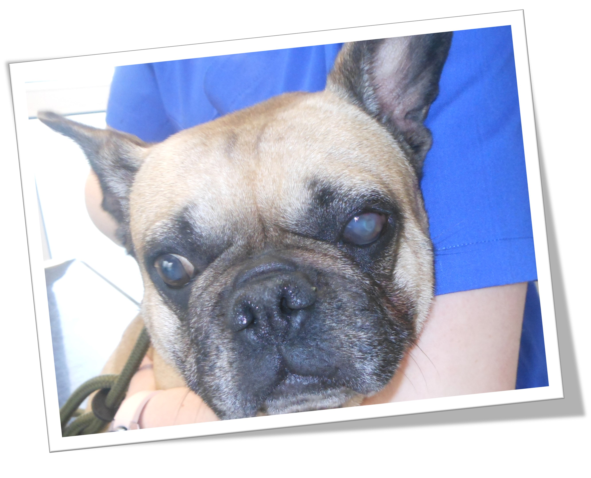
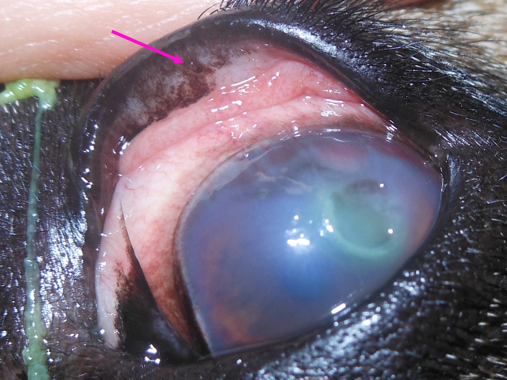
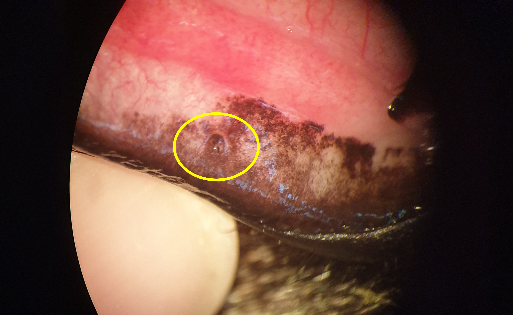
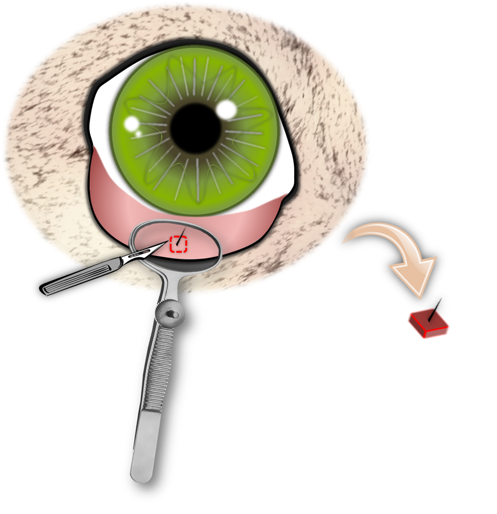
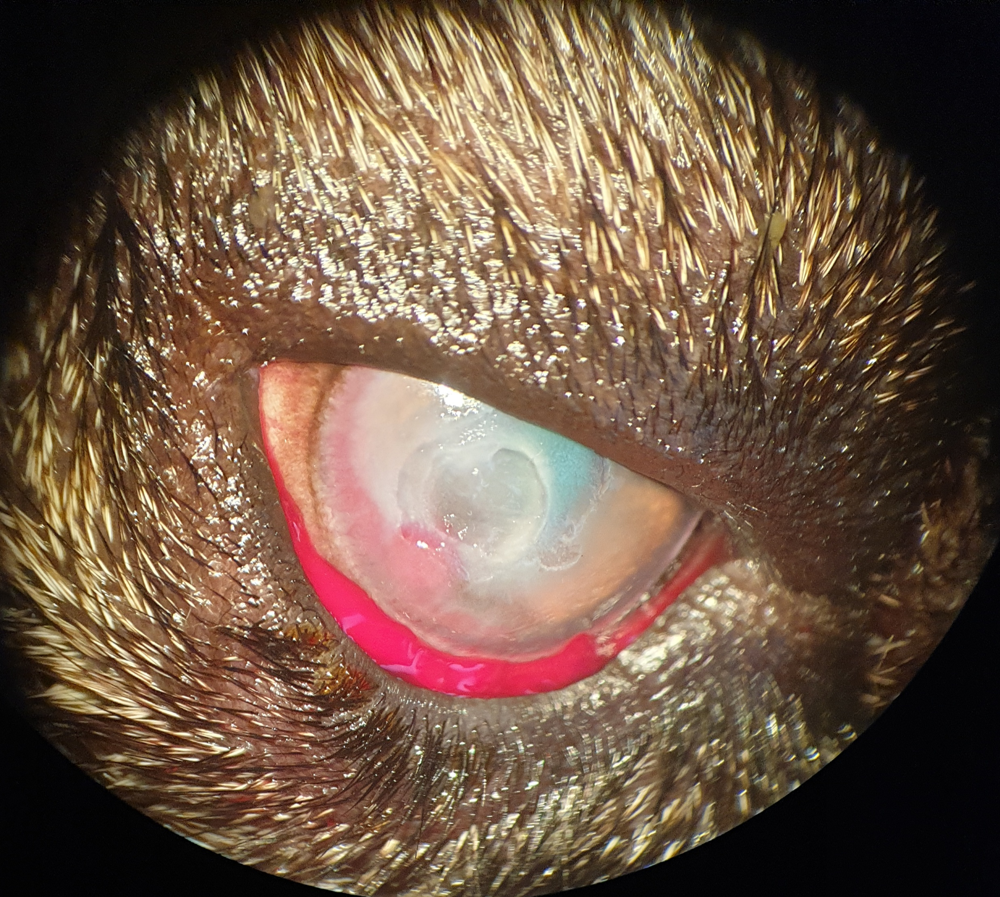

Maja kam in die Augensprechstunde, weil ein schmerzhaftes Loch in ihrer Hornhaut (Ulcus) einfach nicht heilen wollte, obwohl sie die richtigen Augentropfen bekam. Ihr linkes Auge war bereits trüb und ihr Sehvermögen eingeschränkt. Sie wollte ihr schmerzendes Auge die meiste Zeit nicht richtig öffnen.

<!--excerpt-->





## Die Ursache

Ein Blick unter ihr Oberlid zeigte den Übeltäter. Ein kleines Haar, eine sog. _ektope Zilie_, piekste tagein tagaus auf ihre Hornhaut, verursachte so den Defekt und verhinderte dessen Heilung. Sie wuchs aus Majas Bindehaut heraus und zeigte direkt auf ihr Auge. Bei jedem Lidschlag verschlimmerte die Zilie Majas Problem weiter.

Diese versteckten Härchen sehen wir bei Französischen Bulldoggen häufig. Auch Shih Tzus und Möpse sind häufiger betroffen.





## Was nun?

Es gab nur eine Lösung. Das Haar musste mitsamt der Wurzel entfernt werden. Da diese Haare sehr klein sind, braucht man dafür ein Op-Mikroskop. Das Haar wird umschnitten und entfernt. 













Nachdem der Störenfried beseitigt war, war der Weg für die Heilung frei. Frauchen und Herrchen haben fleißig Augentropfen gegeben und Maja geht es jetzt wieder gut.

Eine kleine Narbe wird immer an den großen Defekt erinnern.





## Wenn ein Hornhautdefekt nicht schnell besser wird, ist es wichtig, nach einer Ursache zu suchen!

