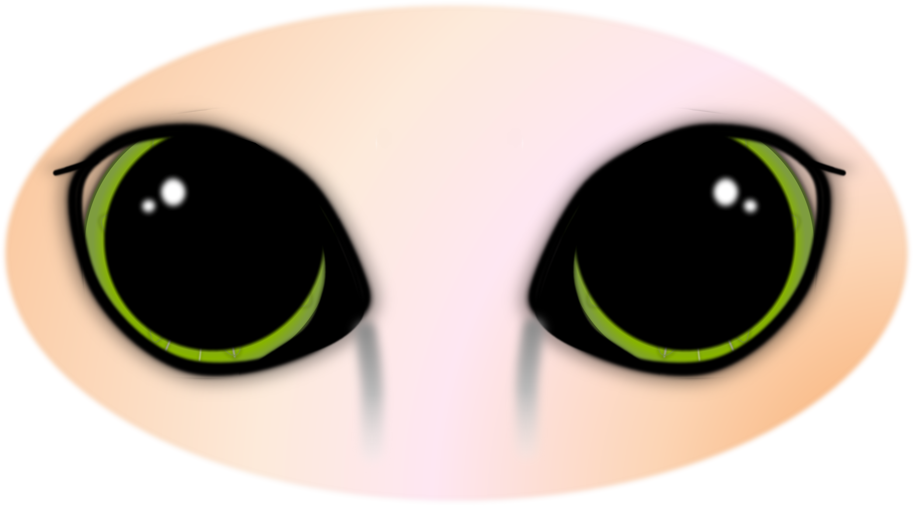
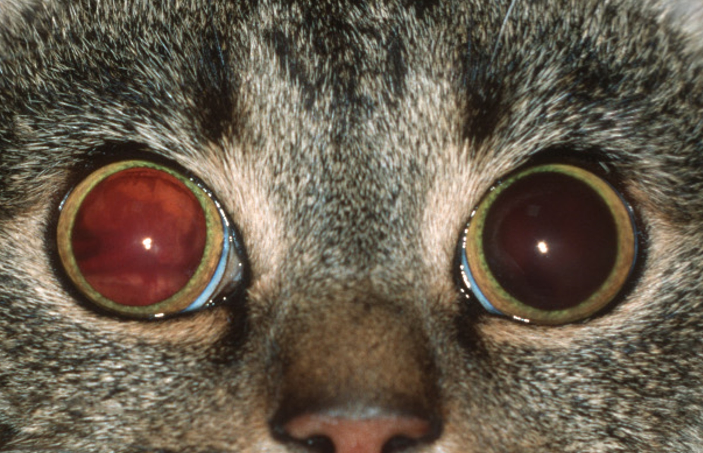

Bluthochdruck ist ein häufiges Problem bei Katzen ab dem 10. Lebensjahr. Er bleibt zumeist lange unbemerkt. Häufig ist das erste auffällige Symptom die plötzliche Erblindung der Katzen oder sichtbare Blutungen im Auge.

<!--excerpt-->

# Auslöser

Bei Katzen sind die häufigsten Auslöser des Bluthochdrucks die Niereninsuffizienz (eingeschränkte Nierenfunktion) und die Schilddrüsenüberfunktion (Hyperthyreose). Auch andere Grunderkrankungen wie Diabetes, Lebererkrankungen, Hyperaldosteronismus, Hyperadrenokortizismus, Phäochromozytome u.s.w. kommen in Betracht, sind aber deutlich seltener. Oft kann keine ‚Erkrankung‘ als Ursache für den Bluthochdruck identifiziert werden (primäre Hypertension). Hier spielt vor allem das höhere Alter an sich eine Rolle, auch Adipositas kann ein auslösender Faktor sein.

## Augenschäden durch Bluthochdruck

Der Bluthochdruck zeigt sich im Auge der Katze vor allem durch eine sog. _Hypertensive Retinopathie_, also eine Schädigung der Netzhaut. Sie beginnt mit kleineren bläschenartigen Abhebungen der Netzhaut und kleineren Blutungen. In diesem Stadium fällt noch kein Sehproblem auf. Mit zunehmender Schädigung kommt es zu großflächigeren Blutungen u./o. der vollständigen Ablösung der Netzhaut und damit zur plötzlichen vollständigen Erblindung.  Auch der Sehnerv kann durch den Bluthochdruck direkt und nachhaltig geschädigt werden (_Hypertensive Opticusneuropathie_). 
Im vorderen Augenabschnitt manifestiert sich der Bluthochdruck v.a. im Bereich der Iris. Hier können Aneurysmen und Blutungen in die vordere Augenkammer auftreten. 

## Symptome

Häufig sind zunächst sehr weite Pupillen auffällig. Dies ist bei einer älteren Katze immer ein Alarmsignal. Der Sehverlust kann gerade von Indoorkatzen oft sehr gut kompensiert werden und wird nicht in jedem Fall bemerkt.  
Das auffälligste Symptom sind plötzliche Blutungen in die vordere Augenkammer. Manchmal treten diese anfangs periodisch auf und verschwinden von allein wieder. Bei weitem nicht jede Katze mit Bluthochdruck und schweren Netzhautschäden zeigt auch Blutungen in die vordere Augenkammer. Das macht die Erkennung der Erkrankung durch den Besitzer deutlich schwieriger. 





















Bluthochdruck kann neben Augenveränderungen auch zu weiteren Symptomen führen z.B. im Verhalten der Katzen. Zum Teil sind die Tiere unruhiger als vorher oder inaktiver, teilweise können sogar Aggressionen auftreten. Auch neurologische Störungen wie beispielsweise Anfälle sind infolge des Bluthochdrucks möglich.

## Diagnose

Ob die Blindheit durch Bluthochdruck verursacht wird, kann bei der Augenuntersuchung eindeutig festgestellt werden. Hierbei wird auch eine Blutdruckmessung durchgeführt, die die Diagnose untermauert. 
Zusätzlich wird eine Blutuntersuchung eingeleitet, um nach möglichen Ursachen für den Bluthochdruck zu suchen. 

## Therapie

Für die Katze stehen sehr wirksame und gut verträgliche Tabletten zur Verfügung. Die schnelle Absenkung des Blutdrucks ist sehr wichtig, denn die Zeit ist ein entscheidender Faktor für das Sehvermögen. 
Außerdem muss eine möglicherweise zugrundeliegende Erkrankung mit therapiert werden.

## Prognose für das Sehvermögen

Ob das Sehvermögen wiedererlangt werden kann, hängt wesentlich davon ab, ob die Katzen rechtzeitig beim Tierarzt vorgestellt wurden. Besteht die Netzhautablösung weniger als eine Woche, gibt es gute Chancen, das Sehvermögen zu erhalten. Besteht die Ablösung länger, bleiben die Tiere oft blind, auch wenn die Netzhaut wieder angelegt ist. Das liegt daran, dass die Nervenzellen der Netzhaut empfindlich sind und während der Ablösung nicht ausreichend versorgt werden, sie degenerieren unwiederbringlich. 
Ist es zu ausgedehnten Blutungen im hinteren Augenabschnitt gekommen, ist die Prognose leider ungünstig. Moderate Blutungen im vorderen Augenabschnitt hingegen heilen häufig restlos aus.

## Prophylaxe

___Blindheit durch Bluthochdruck der alten Katze kann durch regelmäßige Vorsorgeuntersuchungen sehr gut verhindert werden!___ Ab dem 10. Lebensjahr sind vorsorgliche regelmäßige Blutdruckmessungen (mind. 1-2x pro Jahr) ratsam. Auch der jährliche Check der Nieren- und Schilddrüsenfunktion ist sinnvoll.  