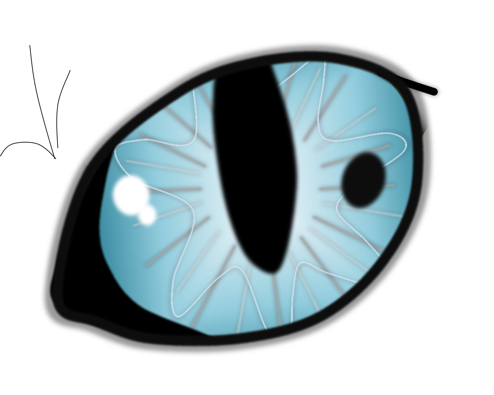
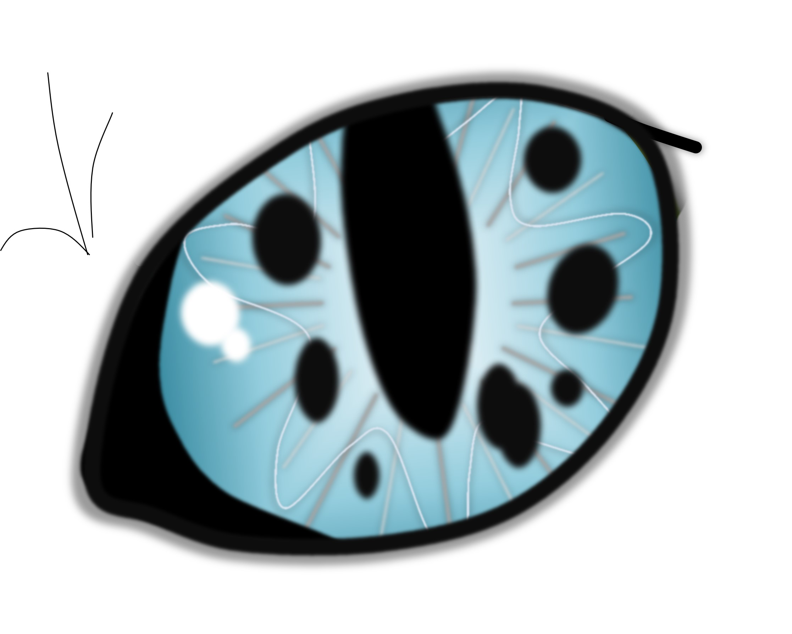
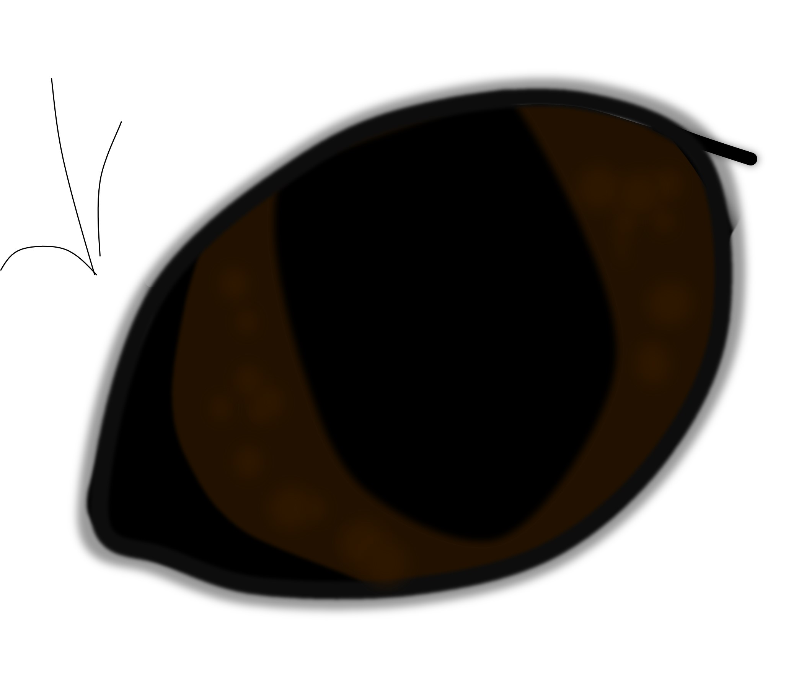
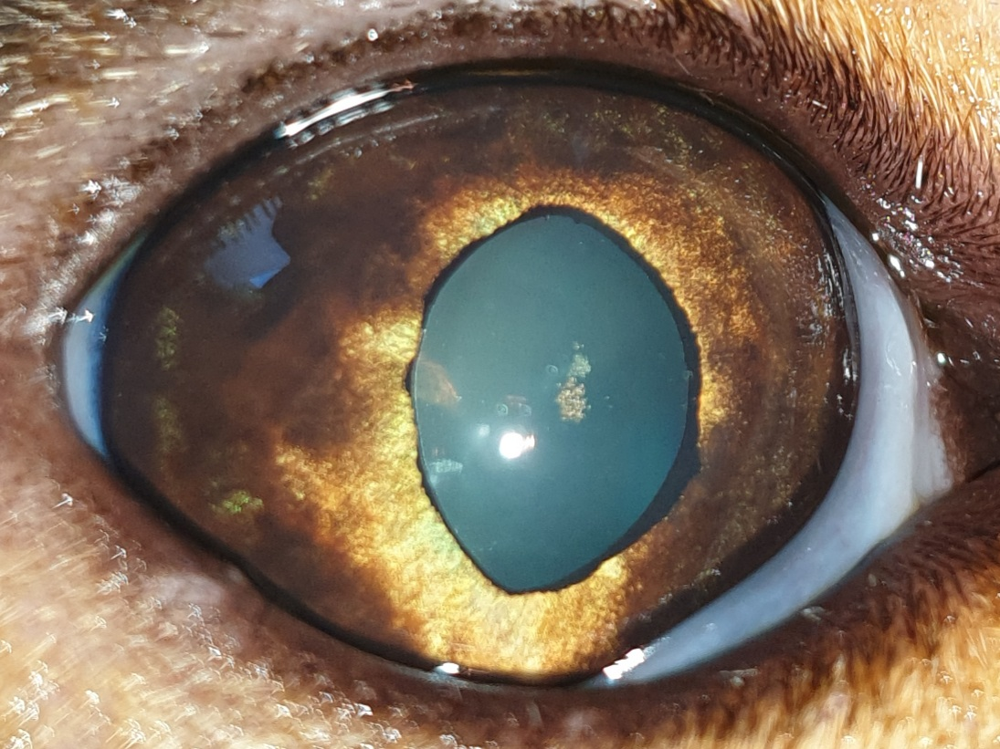
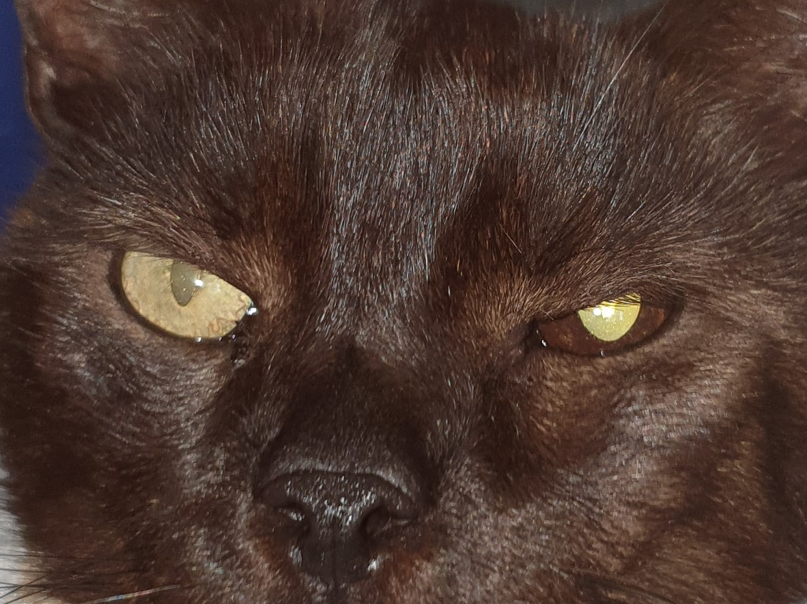
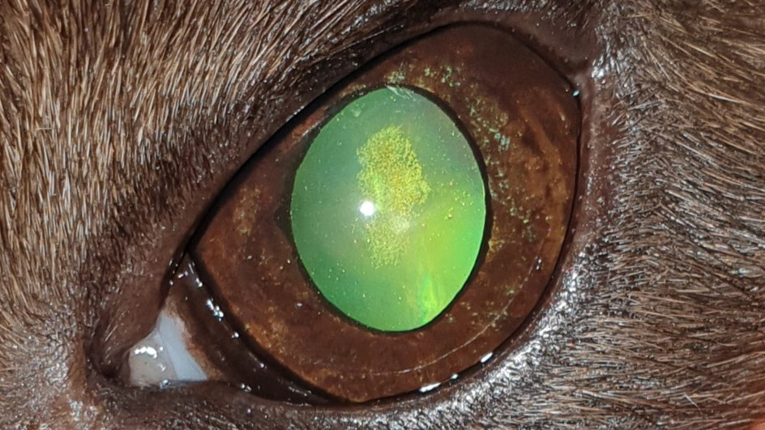

Pigmentzellen, sogenannte Melanozyten in der Iris (Regenbogenhaut) können braune Flecken auf der Irisvorderfläche verursachen. Diese nennt man dann Irisnaevus/ Irisnaevi oder Hyperpigmentationen. Handelt es sich um eine pathologische Pigmentierung, also um einen pigmentierten Tumor der Iris, spricht man vom Irismelanom. Diese kommen bei der Katze in sehr verschiedenen Varianten und Ausprägungen vor. 

_Das Irismelanom der Katze kann schon in frühen Stadien in andere Organe streuen!_

<!--excerpt-->

# Symptome

Das Irismelanom beginnt mit einem pigmentierten Fleck oder pigmentierten Arealen in der Iris. Diese Flecken werden größer und verändern ihre Form, Farbe und Oberfläche. Später hat sich oft die Farbe der gesamten Iris verändert. Im Lauf der Zeit wird die Pupillenfunktion beeinträchtigt und die Pupille wird nicht mehr so eng wie die der anderen Seite und ist im Endstadium oft unförmig (Dyskorie). Sehprobleme oder Blindheit treten erst spät im Verlauf auf. Auch Rötung und Trübung des Auges durch Entzündungen, die der Tumor verursacht, finden sich erst spät. In weit fortgeschrittenen Stadien folgt dann eine schmerzhafte Erhöhung des Augeninnendrucks (Glaukom, Grüner Star) und das Auge kann sich sogar vergrößern. 

_Grundsätzlich sollte ein schnell größer werdender Pigmentfleck in der Katzeniris als verdächtig angesehen und abgeklärt werden._

Tückischerweise gibt es auch das amelanotische Melanom. Hier finden wir keine vermehrte Pigmentierung der Iris.

## Diagnose

Bei der Augenuntersuchung werden Pigmentflecken auf ihre Eigenschaften mit einer Vergrößerung (Spaltlampe) untersucht. Es wird dabei auf bestimmte Kriterien geachtet. Beispielsweise spielen die Farbe, Homogenität oder Heterogenität, Erhabenheit und Abgrenzbarkeit eine Rolle. Es wird untersucht, ob das Pigment auf die Irisvorderfläche beschränkt ist, wie es bei normalen Pigmentierungen typisch wäre, oder sich in das Irisstroma ausgebreitet hat, was für einen Tumor spricht. Dies kann besser nach Weitstellen der Pupille beurteilt werden. Auch freies Pigment auf der vorderen Linsenkapsel, im Kammerwasser und Kammerwinkel ist bei einfachen Pigmentflecken nicht zu erwarten, bei Tumoren aber häufig. Manchmal ist hierfür eine Kammerwinkeluntersuchung mit einer speziellen Linse (Gonioskopie) notwendig. Außerdem wird auf die Pupillenfunktion und Entzündungsanzeichen sowie Veränderungen des Augeninnendrucks geachtet. 

Im Anfangsstadium ist eine Unterscheidung von normalen Pigmentierungen oft gar nicht möglich. Entscheidend sind daher Verlaufskontrollen. Die Dokumentation mit Fotos ist dabei unerlässlich und kann auch vom Besitzer selbst durchgeführt werden.  

Die endgültige Diagnose wird bei der histopathologischen Untersuchung nach Entfernung des Auges und damit des Tumors gestellt. Erst dann sind Aussagen über die Wahrscheinlichkeit einer Metastasierung möglich. Hierfür achten die Pathologen auf bestimmte Hinweise. Beispielsweise machen die Invasion des Tumors in die Choroidea (Aderhaut) des Auges oder eine Ausbreitung über die Sklera hinaus eine Metastasierung wahrscheinlicher. 

## FDIM

Das _**F**eline **D**iffuse **I**ris**m**elanom_ ist eine häufige Form des Irismelanoms der Katze. Hierbei wächst das Melanom nicht als einzelner Fleck. Stattdessen betrifft die tumoröse Pigmentierung große Teile der Iris oder die gesamte Fläche. Manchmal ist hier eine Veränderung der Irisfarbe das erste Symptom oder es finden sich großflächige bräunliche Areale oder multiple Flecken in der Iris, die sich ausbreiten, vergrößern und konfluieren. Diese Form kann sich sehr unterschiedlich verhalten.

_Es ist deshalb bei dieser Tumorart kaum möglich, klinisch sichere Aussagen über die Bösartigkeit des Tumors, die Prognose und das Fortschreiten zu treffen._
 

























## Therapie

Die Therapie richtet sich nach der Klinik. In frühen Stadien sind die Augen idR schmerzfrei und sehfähig. Hier wird der Tumor häufig erst engmaschig beobachtet. Später muss das betroffene Auge entfernt werden, besonders dann, wenn ein FDIM vorliegt. 
Etwas anders ist es bei abgegrenzten Melanomen. In den letzten Jahren hat sich hier, wie beim Hund, die Lasertherapie etabliert. In sehr <u>ausgewählten</u> Fällen kann diese augenerhaltende Therapie auch bei Katzen Anwendung finden. 
 

## Prognose 

Die Prognose ist von vielen Faktoren abhängig. Eine besondere Rolle spielt der Zeitpunkt der Tumorentfernung. Wird das Auge in frühen Stadien entfernt, unterscheidet sich die Lebensdauer nicht von gesunden Katzen. Damit geht allerdings einher, dass die Katze ein sehfähiges, nicht schmerzhaftes, für die Katze völlig komfortables Auge verliert. Wird das Auge wiederum in späten Stadien entfernt, ist das Risiko einer Metastasierung deutlich höher. 
Den richtigen OP-Zeitpunkt zu finden, ist also keinesfalls einfach.

_Es sollte auf jeden Fall nicht abgewartet werden bis das Auge ein Glaukom entwickelt hat._

