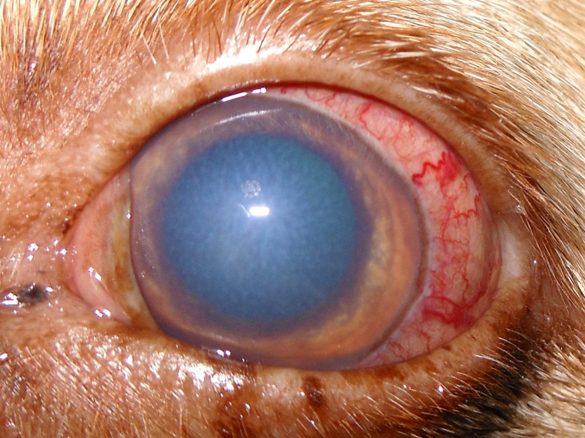
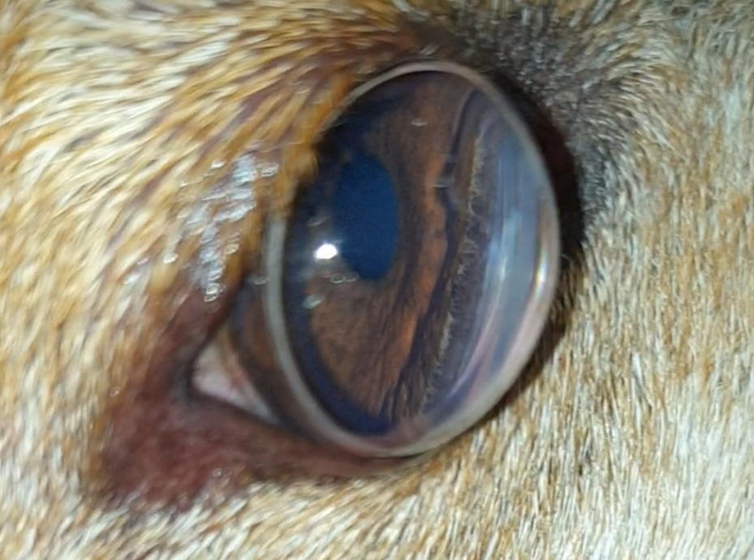
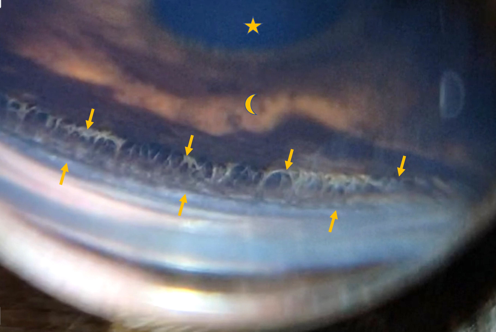
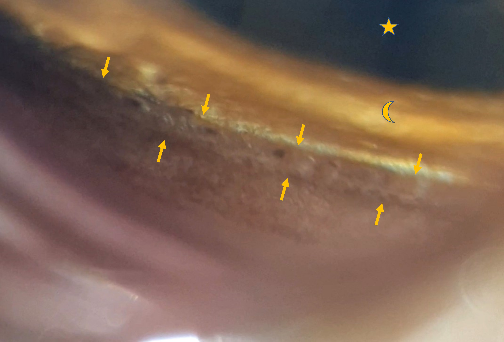

Das Glaukom ist eine Erkrankung, die mit einer Erhöhung des Augeninnendrucks einhergeht. Dies zieht Schäden der Netzhaut und des Sehnerven nach sich. Erblindung kann die Folge sein. 

<!--excerpt-->

# Ursache

Im Augeninneren gibt es einen Abfluss (Kammerwinkel), über den das ständig produzierte Kammerwasser abfließt. Er liegt zwischen Irisbasis und Hornhaut. Gibt es hier ein Problem, kommt es zu einem Stau und der Augeninnendruck steigt an. Abflusshindernisse können durch folgende Faktoren verursacht werden:

__Missbildungen__: Ist der Kammerwinkel nicht richtig ausgebildet nennt man dies Goniodysplasie. Viele Tiere mit dieser Fehlbildung entwickeln ein Glaukom im Laufe des Lebens, aber nicht jedes. Dieses Glaukom nennt sich dann Primärglaukom. Manche Rassen sind hierfür prädisponiert wie beispielsweise Entlebucher Sennenhund, Husky, Samojede, Amerikanische Cockerspaniel, Bassets und andere. Bei Katzen ist das Primärglaukom extrem selten.

Verlegung des Kammerwinkels bei __Entzündungen (Uveitis) und Blutungen__: Die Iris schwillt an, Entzündungsprodukte und/oder Blut verstopfen den Abfluss und der Druck steigt. Dieses Glaukom ist dann ein Sekundärglaukom und kann vorübergehend sein.

__Verwachsungen/Verklebungen__ des Kammerwinkels nach Entzündungen und Blutungen können auch lange nach Abklingen der akuten Symptome zum Glaukom führen.

__Tumore:__ intraokuläre Tumore können direkt den Kammerwinkel einengen allein durch ihre Masse oder durch abgeschilferte Tumorzellen. Auch Entzündungen und Blutungen, die der Tumor verursacht können zum Sekundärglaukom führen.

__Linsenluxation:__ Eine lockere oder abgerissene Linse verursacht ebenfalls häufig einen Druckanstieg im Auge. Dies betrifft besonders Terrierrassen und dabei ganz besonders den Jack Russel und Bullterrier.

## Symptome

Typische Symptome sind Rötung und Trübung des Auges. Häufig treten diese sehr plötzlich auf. Die Erkrankung ist schmerzhaft, deshalb wird das betroffene Auge oft zugekniffen oder die Patienten schlafen mehr und sind inaktiver. Die Blindheit fällt oft nicht auf, solange sie nur einseitig ist. Bei der Katze sind die Symptome weniger deutlich, vor allem Hornhauttrübungen treten kaum auf. Ungleich große Pupillen sind in jedem Fall ein Warnsignal.





## Therapie

Die Therapie sollte so schnell wie möglich, möglichst innerhalb der ersten Stunden, erfolgen. _Irreparable_ Schäden an Sehnerv und Netzhaut treten nämlich sehr schnell auf. Ein akuter Glaukomschub ist ein Notfall und wird mit Augentropfen und ggf. Tabletten oder Infusion behandelt. Sinkt der Druck nicht in kurzer Zeit in den Normalbereich, kann ein Ablassen von Kammerwasser (Vorderkammerparazentese) mit einer kleinen Nadel vorübergehend den Druck senken und den Sehnerv entlasten. Danach müssen dauerhaft drucksenkende Augenmedikamente gegeben werden. Häufig lässt sich das Primärglaukom medikamentell nicht dauerhaft kontrollieren. Es gibt zusätzlich chirurgische Möglichkeiten, den Augendruck bei sehfähigen Augen niedrig zu halten. Hierzu zählt v.a. die Lasertherapie in Kombination mit einer Shuntimplantation. Die Laserbehandlung kann von außen (transskleral) oder innen (Endolaser) erfolgen. Die transsklerale Methode ist häufig nicht erfolgreich. Besser geeignet ist der Endolaser, bei dem der Ziliarkörper unter direkter Sichtkontrolle mit dem Laser erreicht wird. In der Regel ist zusätzlich eine Kunstlinsenimplantation notwendig. Optimalerweise wird diese OP mit dem Einsetzen einer Klappe (Shunt) kombiniert, die überschüssiges Kammerwasser aus dem Auge ableiten kann. Diese OP ist sehr aufwändig und leider nicht in jedem Fall erfolgreich. 

Ist ein Auge bereits vollständig erblindet und der Augeninnendruck sinkt auch unter Therapie nicht in den schmerzfreien Normalbereich, sollten chirurgische Maßnahmen veranlasst werden, um dem Patienten Schmerzfreiheit zu ermöglichen. Hier gibt es im Wesentlichen 3 Methoden:

<u>Chemische Ziliarkörperablation:</u> Hierbei wird ein bestimmtes Antibiotikum, das Gentamicin, in den Glaskörper des Auges injiziert. Gentamicin wirkt toxisch auf den Ziliarkörper, die kammerwasserproduzierende Struktur des Auges. Ist die Injektion erfolgreich, kann das Auge erhalten bleiben und der Intraokulardruck sinkt dauerhaft. Nicht jeder Patient kommt nach Behandlung ohne drucksenkende Tropfen aus. Manchmal ist eine wiederholte Behandlung nötig. Es kann auch zu Komplikationen kommen wie beispielsweise Entzündungen oder ein Schrumpfauge. Die Methode bedarf nur einer sehr kurzen Narkose und ist kostengünstig. Allerdings heben die notwendigen Nachbehandlungen und ggf. noch notwendigen Tropfen den Kostenvorteil gegenüber den anderen Operationen auf. 

<u>Augenentfernung (Enukleation):</u> Bei dieser OP wird das Auge entfernt und die Lider verschlossen. Die Patienten sind in der Regel nach 3 Tagen schmerzfrei. Nach dem Fädenziehen sind keine weiteren Nachbehandlungen notwendig. 

<u>Intraskleralprothese:</u> Hier wird nur das Augeninnere entfernt (Iris, Ziliarkörper, Linse, Glaskörper, Ader- und Netzhaut). Anschließend wird eine Silikonkugel der passenden Größe eingesetzt und der Augapfel wieder vernäht. Die Prothese erscheint im Tageslicht sehr unauffällig und ist eine optisch ansprechendere Variante als die Augenentfernung. Die Zeit bis zur Schmerzfreiheit ist etwas länger als bei der Augenentfernung, hier müssen 1 bis 2 Wochen gerechnet werden. Diese Augen werden meist noch für ca. 8 Wochen Augentropfen benötigen.

## Prophylaxe

Zur frühesten Prophylaxe gehört, dass mit vom Primärglaukom betroffenen Tieren nicht gezüchtet wird, da diese Glaukomform erblich ist. Bei besonders gefährdeten Rassen wird vor der Zuchtzulassung eine Kammerwinkeluntersuchung (Gonioskopie) durchgeführt, um eine Missbildung schon vor der Zucht zu erkennen. Bei Tieren mit einer Kammerwinkelmissbildung, die bereits ein Glaukom auf einem Auge entwickelt haben, kann es ratsam sein, das andere Auge mit drucksenkenden und ggf. entzündungshemmenden Augentropfen prophylaktisch zu behandeln und regelmäßig zu kontrollieren. Eine prophylaktische Endolaserbehandlung ist möglich aber nicht risikofrei. 

_Wichtig ist es bei Verdacht auf einen Glaukomschub innerhalb der ersten Stunden eine Behandlung einzuleiten._













