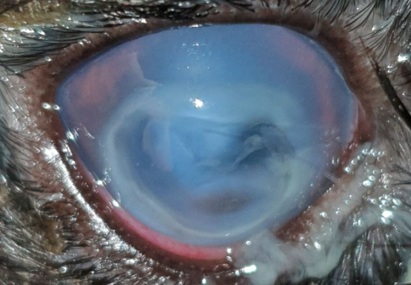
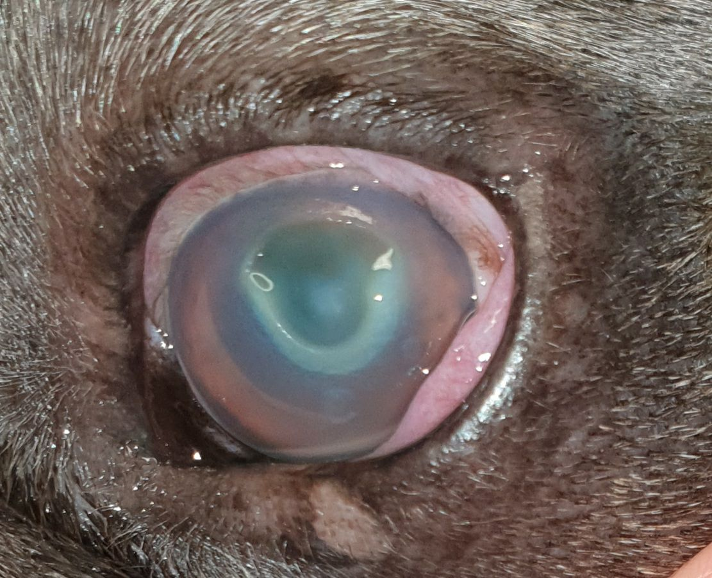
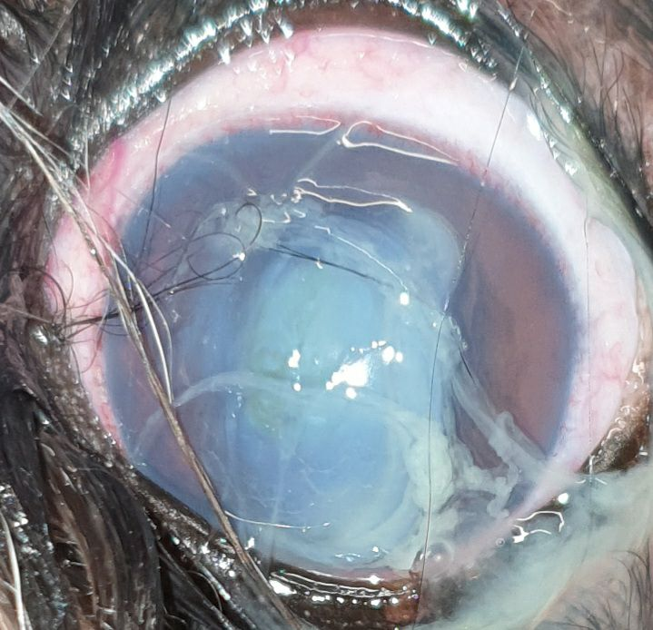
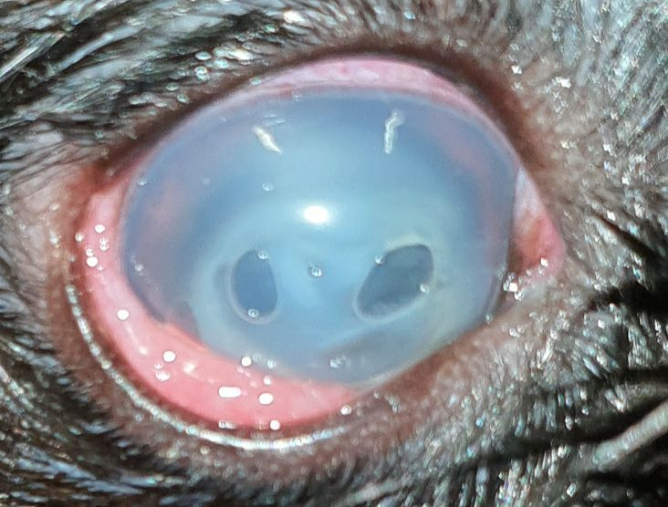

Ein einschmelzendes Hornhautulcus ist eine, das Augenlicht bedrohende, rasant fortschreitende Erkrankung. Sie muss als Notfall behandelt werden.

<!--excerpt-->

## Ursache

Ein Hornhautdefekt infiziert sich mit Bakterien, die Enzyme produzieren (Proteasen, Kollagenasen), die die Hornhautstruktur angreifen und auflösen (Keratomalazie). Die Hornhaut fließt geradezu auseinander. Zu diesen Bakterien zählen v.a. Pseudomonaden und beta-hämolysierende Streptokokken. Schon eine oberflächliche Verletzung der Hornhaut reicht aus. Die Erreger können ins Stroma eindringen und der Lyseprozess kann in wenigen __Stunden__ einen sehr tiefen Defekt verursachen. Innerhalb eines Tages kann sogar eine Hornhautperforation entstehen, d.h. Kammerwasser läuft aus.

_Da die Erkrankung von potenziell multiresistenten Keimen verursacht wird, sollten Sie als Patientenbesitzer eine gewisse Umsicht im Umgang mit dem erkrankten Auge walten lassen. Kontakt zwischen Augensekret und offenen Wunden sollte vermieden werden._

## Symptome

Die Hornhaut trübt sich rasant ein und eitriger Augenausfluss tritt auf. Bei genauem Hinsehen erscheint die Hornhaut weich und bekommt ein puddingartiges Aussehen. Die betroffenen Tiere kneifen das Auge zu und sind häufig schmerzbedingt ruhiger als sonst. Hier ist Eile geboten. 













## Diagnose

Die Diagnose wird bei der Augenuntersuchung durch das typische Erscheinungsbild gestellt. Eine Anzucht der Bakterien im Labor hilft die verantwortlichen Keime zu identifizieren. Für die Wahl des richtigen Antibiotikums käme das Ergebnis aber zu spät. Die bakteriologische Untersuchung und das Antibiogramm müssen idR aus arzneimittelrechtlichen Gründen durchgeführt werden, da nur dann die notwendigen Antibiotika aus dem humanmedizinischen Bereich bei Tieren angewandt werden dürfen.   

## Therapie 

Für eine erfolgreiche Therapie ist der Zeitfaktor entscheidend. Die Behandlung zielt darauf ab, die zugrundeliegende Infektion zu bekämpfen, den Einschmelzungsprozess zu stoppen und die Hornhaut temporär zu stabilisieren. Je nach Schwere der Erkrankung kommen hier unterschiedliche Verfahren zum Einsatz.
Eine gezielte, intensive antibiotische Therapie wird umgehend begonnen. Zusätzlich werden Augentropfen eingesetzt, die das Auflösen der Hornhaut eindämmen können. Stammzellhaltige Augentropfen aus Amnion können in schweren Fällen verwendet werden. Kontaktlinsen aus Kollagen, das Protein aus dem die Hornhaut aufgebaut ist, bringen vorübergehend Stabilität und helfen beim Wiederaufbau. Sie kommen vor allem bei tieferen Defekten zum Einsatz. Diese Linsen lösen sich dann innerhalb von 72 Stunden auf. 

Sehr tiefe oder gar perforierte Defekte müssen operiert und mit einem Transplantat versorgt werden. 









## Prognose

Das einschmelzende Hornhautulcus ist eine schwerwiegende Erkrankung. Die Prognose ist abhängig von der Größe, der Tiefe und dem Ansprechen der Bakterien auf die medikamentelle Therapie. Im schlimmsten Fall kann es zum Augenverlust kommen. Eine bleibende Beeinträchtigung des Sehvermögens kann durch Narbenbildung auftreten. 

_BEI VERDACHT DARF NICHT GEWARTET WERDEN - JEDE STUNDE ZÄHLT. JE EHER THERAPIERT WIRD, DESTO BESSER IST DIE PROGNOSE._ 
