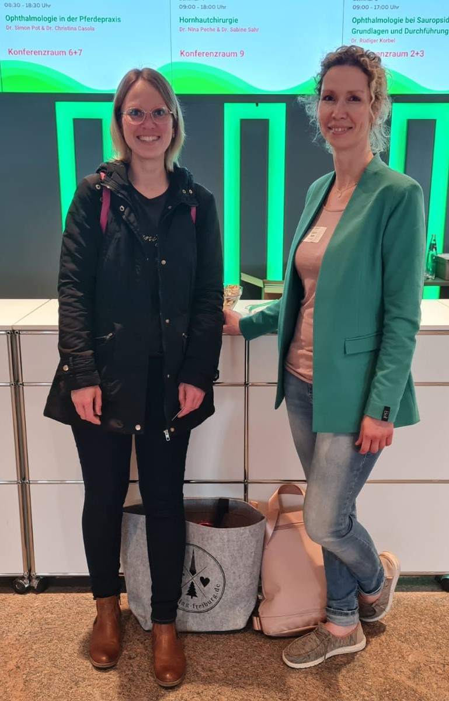

DIE [VORTRÄGE](#vorträge) FINDEN SIE ZUM DOWNLOAD UNTEN AUF DER SEITE.

<!--excerpt-->





## Vorträge

1. [Bindehautlappenplastik und Corneokonjunktivale Transposition](../assets/misc/2023/FVO-23-Bindehautlappenplastik-Corneokonjunktivale-Transposition.pdf)
2. [Abrasio corneae, Superficial Grid Keratotomy und Diamond Burr Debridement](../assets/misc/2023/FVO-23-Abrasio-corneae-Superficial-Grid-Keratotomy-Diamond-Burr-Debridement.pdf)

