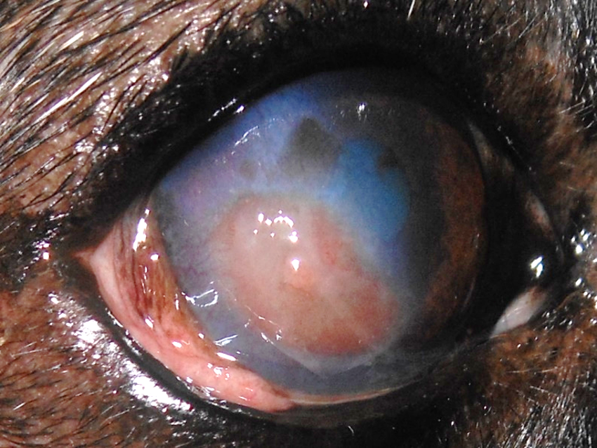
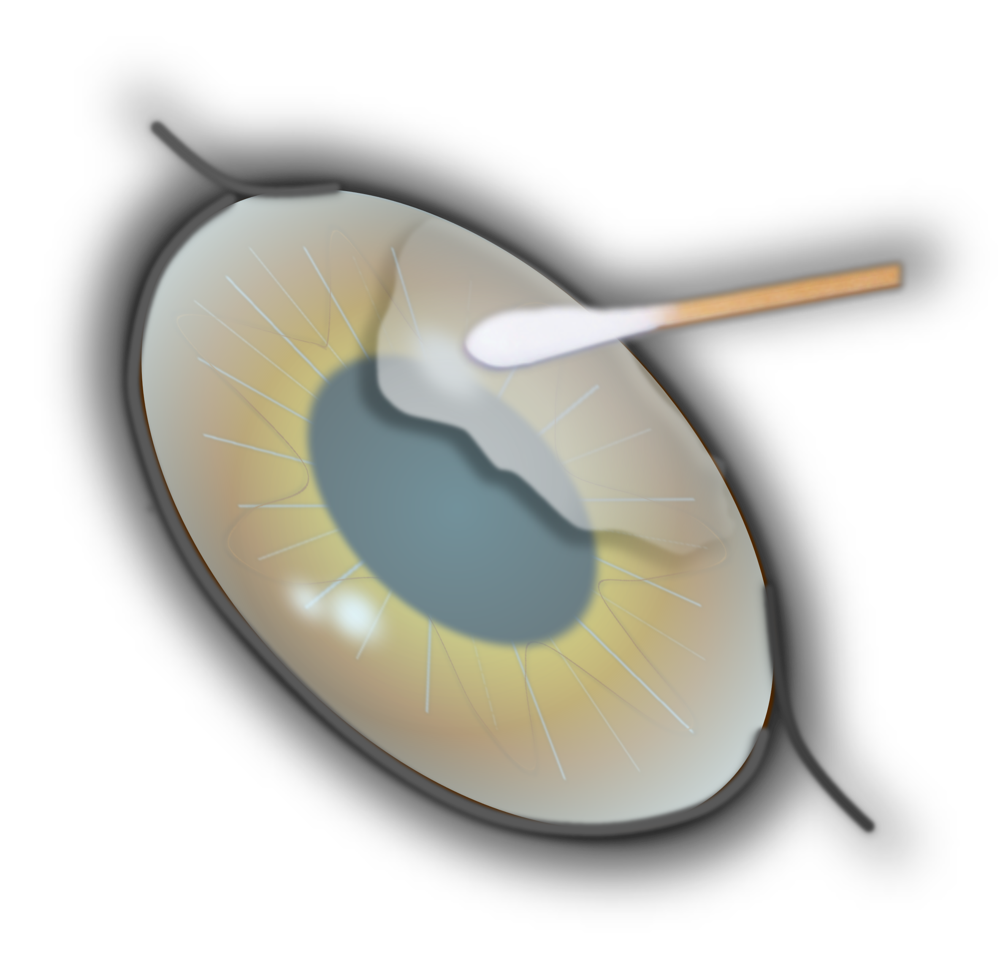
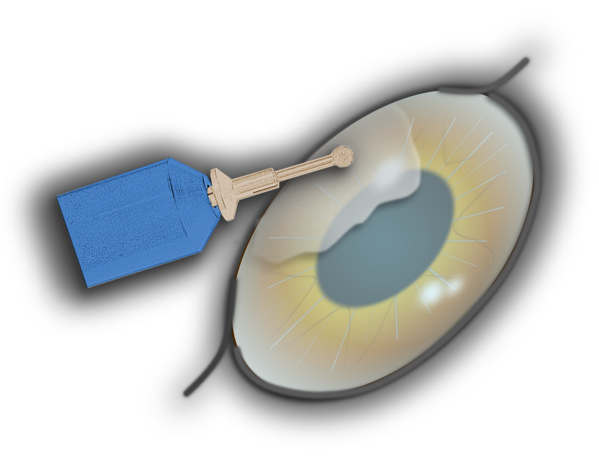
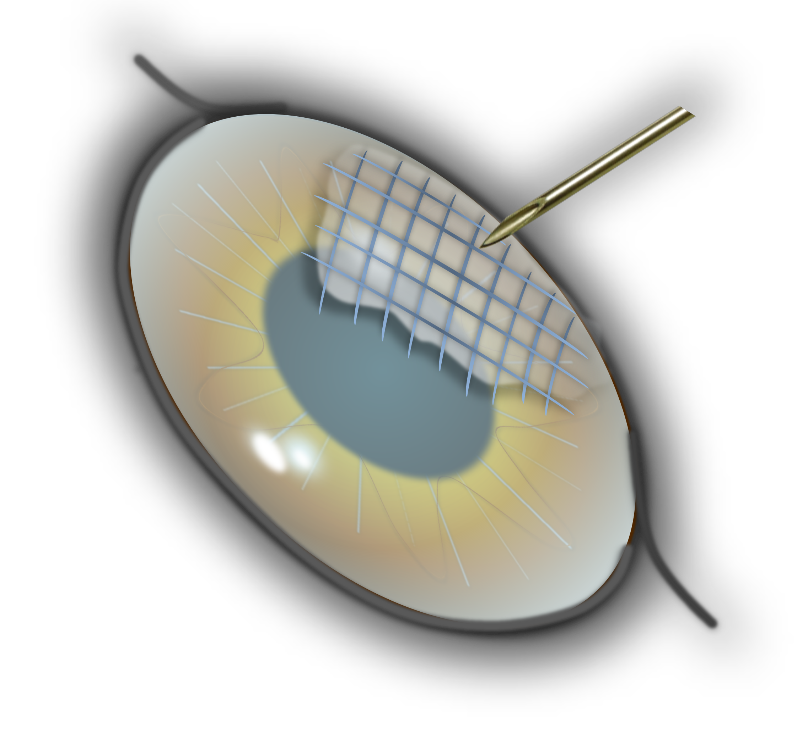
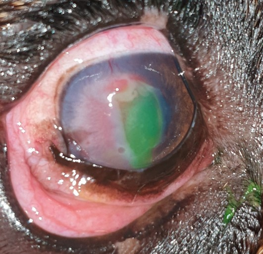

Ein SCCED ist ein oberflächlicher, nicht heilender Defekt der Hornhaut. Es entsteht ein ‚Riss‘ im sogenannten Epithel, der dünnen Schicht, die die Hornhaut nach außen verschließt. 

<!--excerpt-->

> Synonyme: _Ulcus Indolens, Ulcus Recurrens, Boxerulcus_

## Auslöser

Eine Verletzung ist selten die Ursache. In der Regel entstehen diese Defekte spontan. Es scheinen altersbedingte Veränderungen der Hornhaut hierfür verantwortlich zu sein. Es wurden verschiedene Veränderungen des Hornhautstromas (Hauptschicht der Hornhaut) identifiziert. Unter anderem verhindert eine hyaline azelluläre Zone (HAZ) die feste Anhaftung von neu gebildeten Epithelzellen an das Stroma und damit die Heilung. Betroffen sind Hunde ab einem Alter von 5 Jahren. Bestimmte Rassen, zB der Boxer, sind besonders häufig betroffen.

## Symptome

Hunde mit einem SCCED zeigen typischerweise ein gerötetes, tränendes Auge, das sie meist zukneifen oder weniger weit öffnen. Viele Tiere reiben zumindest zeitweise mit den Pfoten über die Augen. Beim SCCED nehmen diese Symptome recht häufig im Laufe der Zeit ab bzw. weisen starke Schwankungen der Intensität auf, so dass zwischenzeitlich ein Eindruck der Besserung entstehen kann. Daher auch der Name Ulcus indolens (indolens= nicht schmerzhaft).

## Diagnose

Die Diagnose SCCED wird durch die Kombination aus Alter des Patienten, Verlauf der Erkrankung und das typische Erscheinungsbild gestellt. Charakteristisch sind die losen, umgeschlagenen  Epithelränder am Defektrand. 





## Therapie – Abrasio Corneae

Anders als bei einem ‚normalen‘ Hornhautdefekt, ist die ausschließliche medikamentelle Therapie beim SCCED nicht ausreichend. Ein SCCED heilt in der Regel nicht spontan ab. Notwendig ist ein kleiner chirurgischer Eingriff in Lokalanästhesie, die sogenannte Abrasio corneae. Dabei werden die losen, avitalen Epithelränder entfernt, der Rand des Defektes geglättet und die Wundfläche angerauht (Entfernung der HAZ). Dies ermöglicht nun dem neu gebildeten Epithel, wieder Halt an der Hornhaut zu finden und abzuheilen. Im Anschluss wird in der Regel eine Verbandskontaktlinse eingesetzt. Es gibt verschiedene Verfahren, die für die Abrasion Anwendung finden. 

Nach dem Eingriff werden antibiotische Augentropfen verabreicht, um die Hornhaut vor einer bakteriellen Infektion zu schützen. Aus diesem Grund ist es auch ratsam, die Spaziergänge kurz zu halten und Reiben am Auge zu verhindern (ggf. mithilfe eines Halskragens).

Die meisten SCCEDS heilen nach einmaliger Abrasio innerhalb von 10 Tagen ab (74-85%). Bei einem Teil der Patienten ist eine ein oder zweimalige Wiederholung der Prozedur notwendig, um eine Heilung zu erzielen. Das betrifft vor allem Französische Bulldoggen.
Wenige Tage nach der Behandlung sollte das Auge kontrolliert werden. Komplikationen treten nach Diamond Burr Debridement nur in ca. 4,5% der Fälle auf und diese sind, frühzeitig erkannt, gut in den Griff zu bekommen. 

In sehr seltenen Fällen tritt auch mit der Abrasio keine Heilung ein. Bei diesen Patienten ist dann  ein chirurgischer Eingriff in Vollnarkose notwendig. Dabei wird das geschädigte, nicht heilende Hornhautareal entfernt (Keratektomie).













## Prognose

Eine Abheilung der Hornhaut kann mit entsprechender Therapie in jedem Fall erreicht werden. Mitunter ist der Verlauf langwierig. Nach dem Abheilen ist das betroffene Auge voll funktionsfähig und in der Regel narbenfrei. Bei manchen Patienten bilden sich während der Heilung zahlreiche Blutgefäße in der Hornhaut (besonders bei Französischen Bulldoggen und Boxern). In diesen Fällen kann eine sichtbare Narbe bleiben. Nicht selten (in etwa 84%) tritt das SCCED im Laufe der nächsten 24 Monate auch auf dem anderen Auge auf.



